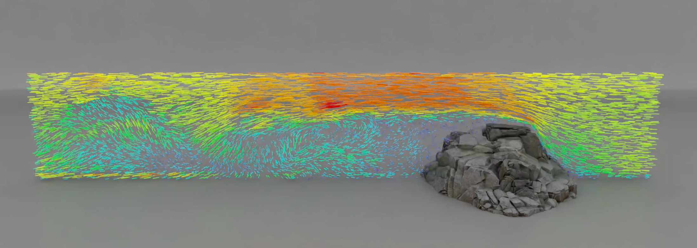

# NVIDIA Warp

Warp is a Python framework for writing high-performance simulation and graphics code. Kernels are defined in Python syntax and JIT converted to C++/CUDA and compiled at runtime.

Please refer to the project [Documentation](https://nvidia.github.io/warp/) for detailed API and language reference.

_A flow field visualization of a NanoVDB fluid simulation_

## Installing

Pre-built packages for Windows and Linux are available on the [Releases](https://github.com/NVIDIA/warp) page. To install in your local Python environment use:

    pip install -e .

From the root directory of this repository.

## Building

For developers wanting to build the library themselves the following tools are required:

* Microsoft Visual Studio 2017 upwards (Windows)
* GCC 4.0 upwards (Linux)
* CUDA Toolkit 11.3

After cloning the repository, developers should run `build.bat` or `build.sh` to generate the `warp.dll` / `warp.so` core library respectively.

## Running Examples

The `examples` directory contains a number of scripts that show how to implement different simulation methods and how to use the Warp API. Most examples will generate USD files containing time-sampled animations in the ``examples/outputs`` directory. Before running examples users should ensure that the ``usd-core`` package is installed using:

    pip install usd-core
    
USD files can be viewed or rendered inside NVIDA Omniverse, Pixar's UsdView, or in Preview on macOS.

## Omniverse

A Warp Omniverse extension is available in the extension registry inside Omniverse Kit or Create. 

Enabling the extension will automatically install and initialize the Warp Python module inside the Kit Python environment. Please see the [Omniverse Warp Documentation](http://docs.omniverse.nvidia.com/extensions/warp.html) for more details on how to use Warp in Omniverse.

## Learn More

Please see our [GTC Presentation](https://www.nvidia.com/gtc/session-catalog/?search=warp&tab.scheduledorondemand=1583520458947001NJiE&search=warp#/session/16384065793850013gEx) for more details on Warp.

## Discord

We have a **#warp** channel on the public [Omniverse Discord](https://discord.com/invite/XWQNJDNuaC) sever, come chat to us!

