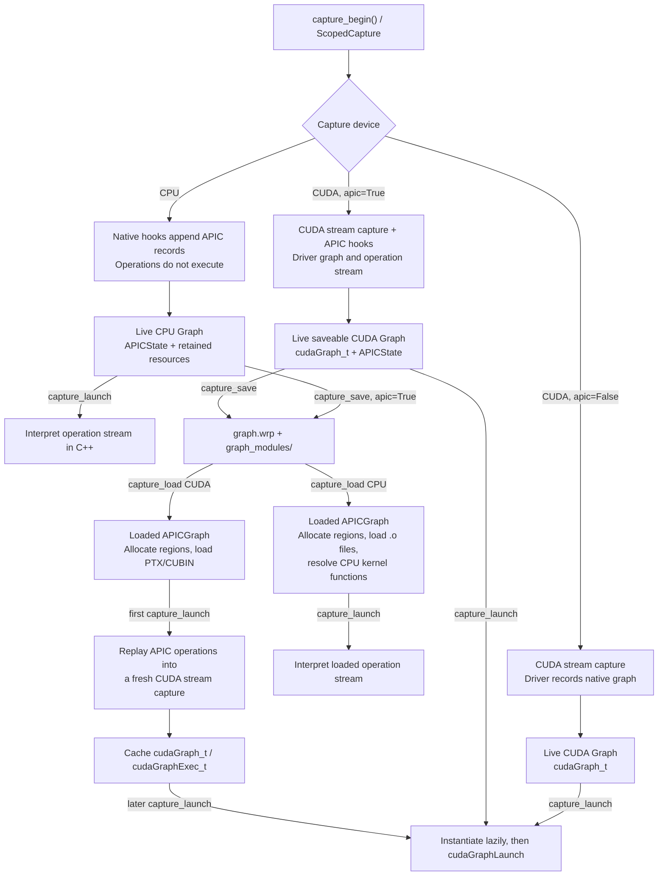

# API Capture and CPU Graphs

**Status**: Implemented (experimental)

**Issue**: [GH-1214](https://github.com/NVIDIA/warp/issues/1214)

## Motivation

Warp's original graph capture feature batches work into a CUDA driver graph and launches it with low host overhead. That model leaves two problems:

- The original implementation has no native graph representation for CPU execution. Without one, each operation is dispatched from Python, an overhead that is especially significant for inexpensive CPU kernels.
- A native ``cudaGraph_t`` is tied to the allocations, modules, and CUDA context of the process that captured it, so it cannot be saved and reconstructed in another process.

API Capture (APIC) addresses both problems by representing captured work as an operation stream within Warp. Serializable graphs use relocatable references so the stream can be saved and rebound in another process. APIC supports three related paths:

1. A live CUDA graph batches work into a native ``cudaGraph_t`` and launches it with low host overhead.
2. A live CPU graph batches work into an API Capture (APIC) operation stream and interprets that stream in native code, avoiding Python dispatch for each operation.
3. A saveable CPU or CUDA graph writes the APIC representation to a ``.wrp`` file and can be loaded in another Python process or a standalone C++ application.

These paths share an operation model, but not an execution mechanism.

The user guide documents the public API and its current limitations. This document defines the internal contracts that implementations must preserve: capture state, execution timing, graph ownership, pointer relocation, operation coverage, serialization, and compatibility.

## Terminology

- **APIC**: API Capture in this document; unrelated to the Affine Particle-In-Cell method demonstrated by [``example_apic_fluid.py``](../warp/examples/fem/example_apic_fluid.py).
- **Graph capture**: The user-facing interval between ``wp.capture_begin()`` and ``wp.capture_end()``, including the equivalent ``wp.ScopedCapture`` context.
- **APIC recording**: Appending operations to the native byte stream owned by an ``APICState``. CPU graph capture always uses APIC recording. CUDA uses it only when ``apic=True``.
- **Operation stream**: The contiguous, versioned byte stream of ``APICOpHeader`` records. It is the CPU replay program and, for a saveable graph, the operations section of a ``.wrp`` file.
- **Native CUDA graph**: The ``cudaGraph_t`` / ``cudaGraphExec_t`` captured by the CUDA driver. A live CUDA graph uses this representation directly.
- **Live graph**: A ``Graph`` returned by ``capture_end()``. Its captured pointers refer to resources in the current process.
- **Loaded graph**: A ``Graph`` returned by ``capture_load()``. Its memory, object handles, modules, and native graph resources are reconstructed from a ``.wrp`` file and its companion modules directory.
- **CPU replay**: Direct interpretation of an APIC operation stream by ``wp_apic_cpu_replay_state()`` for a live graph or ``wp_apic_cpu_replay_graph()`` for a loaded graph.
- **CUDA graph reconstruction**: Reissuing APIC operations while a fresh CUDA stream capture is active, producing a new native CUDA graph for a loaded graph.
- **Memory region**: A base allocation identified by a stable integer within one APIC stream. Pointers in records are represented as a region ID plus a byte offset.
- **Binding**: A user-provided name mapped by ``capture_save(inputs=..., outputs=...)`` to a serialized memory region. Loaded graphs expose bindings through ``set_param()``, ``get_param()``, and ``get_param_ptr()``.

## Requirements

| ID | Requirement | Priority |
| --- | --- | --- |
| R1 | Use one operation stream as the source of truth for CPU replay and serialization | Must |
| R2 | Preserve CUDA's native graph path for live CUDA capture and launch | Must |
| R3 | Defer CPU operations until replay and preserve their original order | Must |
| R4 | Represent process-local pointers through regions, offsets, and relocations | Must |
| R5 | Retain or reconstruct every resource needed by a graph for its documented lifetime | Must |
| R6 | Reject an unsupported operation rather than silently omit it from a saveable graph | Must |
| R7 | Validate operation streams before replay or graph reconstruction | Must |
| R8 | Support Python and standalone C++ loading without rebuilding the original Python program | Must |
| R9 | Version every incompatible ``.wrp`` change and define when recapture is required | Must |
| R10 | Keep live CPU replay free of per-operation Python dispatch | Must |

**Non-goals** (out of scope by design; treat as firm guidance):

- Serializing arbitrary Python code executed during capture. APIC records at native operation boundaries, so arbitrary Python execution is not representable in the stream.
- Inferring semantic operations by inspecting native CUDA graph nodes (see *Alternatives considered*).
- Making compiled kernel binaries portable across every operating system, CPU ABI, CUDA architecture, or Warp release.

**Deferred while APIC is experimental** (not near-term development guidance, but candidates for production-ready support later — do not build against them as if permanent, and do not treat them as settled walls either):

- Stabilizing the Python APIC surface, ``.wrp`` format, and native ``wp_apic_*`` API.
- Supporting multiple devices in one APIC graph.
- Recording compilation or source code needed to compile a missing module.

Deferred CUDA graphs ([GH-1659](https://github.com/NVIDIA/warp/issues/1659)) are separate in-flight work rather than a non-goal; this document describes the current driver-capture path.

## Design

### Architecture and data flow



**Core execution model.** On CPU, the APIC stream is the graph: capture records without executing, and launch interprets the stream in native code. A live CUDA capture launches the driver-produced native graph; ``apic=True`` additionally records a parallel APIC stream for saving, while ``apic=False`` bypasses APIC recording. After a CUDA ``.wrp`` file is loaded, the APIC stream becomes the recipe for lazily reconstructing a new native graph. CPU capture always records because APIC is its only graph representation, so on CPU the ``apic`` flag controls whether saving is permitted rather than whether recording occurs.

### Why recording lives in C++

The first APIC prototype recorded Python objects and translated them to native records later. The implemented design records at native API boundaries instead: kernel dispatch, memory operations, and native helper entry points.

This choice has four consequences:

- The operation stream is immediately usable by CPU replay, serialization, standalone C++, and CUDA reconstruction. There is no second Python operation model to keep synchronized.
- Native helpers that are not visible as Python kernel launches can record their semantics at the correct boundary.
- CUDA capture does not retain a parallel object graph of Python operation records, which could accidentally extend temporary or memory-pool lifetimes.
- Adding an operation still requires Python-side validation or metadata when the native hook cannot recover type information, but it does not require a Python replay implementation.

Python remains responsible for information that is unavailable from raw native pointers: following array ownership chains, describing kernel argument types, finding module binaries, and assigning user-facing binding names.

### Capture state, scope, and lifecycle

``capture_begin()`` creates an ``APICapture`` and its native ``APICState`` for all CPU captures and for CUDA captures requested with ``apic=True``. ``APICState`` holds the operation stream, region table, module and kernel metadata, bindings, handle fixups, and CPU function pointers.

The native active-state pointer is thread-local. The Python runtime also keeps the current ``APICapture`` and its ``Graph`` so launch and array code can provide metadata to the native hooks. This Python coordinator is process-global: it permits only one Warp-managed APIC/CPU capture at a time and rejects a second such capture, even from another thread. CUDA-only stream capture retains its usual stream and capture-mode rules; CPU capture has no stream.

Recording is device-scoped:

- Host hooks see an active state only for a CPU capture.
- CUDA hooks see an active state only for a CUDA capture.
- A host helper invoked during CUDA capture, or a CUDA helper invoked during CPU capture, executes normally and is not inserted into the other device's stream.
- Kernel and array tracking call sites additionally compare the operation's device with the active ``APICapture``.

This prevents a process-global Python capture reference from mixing operations from different device classes.

On CPU, capture hooks append a record and skip the live operation. On CUDA, the CUDA API call still runs on the capturing stream and the matching APIC record is appended. "Runs during CUDA capture" means the driver captures the work as a node; the GPU work is deferred until graph launch.

``capture_pause()`` / ``capture_resume()`` suspend and restart the same APIC state. CPU pause ends recording because there is no native stream to pause. CUDA pause also pauses the native graph; by default it suspends APIC recording at the same boundary. Operations intentionally performed while paused execute live and do not become replay work. Internal conditional capture can keep APIC recording active while temporarily moving CUDA capture into a child graph.

``capture_end()`` closes and validates the APIC stream. CUDA closes the native stream capture as well, and APIC recording is ended even if native CUDA graph creation fails. A failed CUDA end raises instead of returning a usable graph. ``ScopedCapture`` always attempts to end an active capture and preserves the original exception from its body.

### Graph states and ownership

``Graph`` is a tagged container rather than one uniform native object. Its populated fields determine the replay and destruction path.

| Graph kind | Replay representation | Resources owned or retained by ``Graph`` | Caller lifetime obligations |
| --- | --- | --- | --- |
| Live CPU | ``APICState`` byte stream | ``APICapture`` and state; tracked base arrays; CPU module executions and function pointers; Warp-owned capture temporaries routed through tracked allocations | External memory wrapped without a Warp-owned deleter must remain valid at the captured address. Owners of captured process-local handles, including ``Mesh``, ``Bvh``, and ``HashGrid`` objects, must remain alive through every replay |
| Live CUDA, ``apic=False`` | Driver-captured ``cudaGraph_t`` | Native graph and lazy executable; module executions; CUDA allocations transferred to graph ownership by the capture allocator | Pre-existing arrays and external resources referenced by graph nodes must remain alive |
| Live CUDA, ``apic=True`` | Native graph for launch, ``APICState`` for save | Everything in a live CUDA graph, plus the APIC state, metadata, and tracked base-array references | Untracked external pointers and non-serializable object resources remain caller-owned |
| Loaded CPU | ``APICGraph`` byte stream | Fresh host allocation for every region; recreated meshes; loaded LLVM object handles; resolved CPU kernel functions | Keep the ``Graph`` alive while using binding pointers; keep the companion modules available through load |
| Loaded CUDA | Lazily reconstructed native graph owned by ``APICGraph`` | Fresh device allocation for every region; loaded PTX/CUBIN modules; recreated meshes; lazy CUDA graph and executable | Keep the ``Graph`` alive while using binding pointers |

Tracked arrays are retained through their base objects, so aliases do not need independent lifetime management. This guarantee cannot extend the lifetime of memory that Warp does not own. For example, retaining a ``wp.array(ptr=...)`` wrapper without a deleter does not prevent its external owner from freeing or reusing the address.

Live CPU capture does not retain objects referenced through native handles. A ``wp.handle`` launch argument and the records for ``Bvh.refit()``, ``Bvh.rebuild()``, and ``HashGrid.build()`` store only the numeric process-local handle. Destroying the owning object before the final ``capture_launch()`` frees its native resource and leaves replay with a stale handle.

Destruction follows the same ownership split:

- A live CUDA ``Graph`` destroys its native graph and executable.
- A live APIC graph destroys its ``APICState`` through ``APICapture``.
- A loaded ``Graph`` destroys its ``APICGraph``. That object frees its CPU or CUDA regions, recreated meshes, CUDA modules, and reconstructed native CUDA graph. The Python wrapper separately unloads CPU LLVM object handles.

### Memory regions, aliases, and snapshots

#### Region identity

APIC never serializes a data pointer as a persistent address. It assigns monotonic region IDs beginning at 1. A data address in an operation is:

```text
(region_id, byte_offset)
```

Python array tracking follows ``array._ref`` links to the root allocation. The root's pointer and capacity define the region; a view contributes only its offset from that base. Multiple slices, reshapes, or aliases of the same base therefore resolve to one region and preserve their relative offsets.

The ``APICapture`` retains the root array both to keep its storage alive and to prevent Python from reusing its ``id()`` for an unrelated object during the graph lifetime.

Native hooks sometimes receive pointers that have not passed through Python array tracking, such as buffers owned by another native library. The resolver first searches existing regions, grows a containing region when the recorded access extends its known span, and otherwise assigns a new region. CPU registration snapshots host bytes. CUDA registration records the live address and defers device snapshotting until save. This fallback closes a critical correctness rule: a native operation must not disappear merely because Python did not see its allocation.

Region lookup during replay is bounds- and overflow-checked. A missing region or invalid span fails replay instead of producing a best-effort pointer.

#### Persistent and transient contents

``capture_save()`` emits one memory record per serializable region:

- A **snapshotted region** carries its size and initial bytes. CPU memory is copied directly. CUDA memory is copied to host and synchronized before the file is written. A failed required snapshot aborts the save.
- A **size-only region** carries its size but no bytes. A Python-tracked Warp CUDA array region is transient only when its recorded capture origin matches this capture's ``APICState``; merely observing that some capture is active is insufficient. Its capture-time backing is graph-scoped and is no longer a readable persistent allocation after capture ends, so its contents must be produced by recorded replay operations. Native-only CUDA regions have no Python capture-origin marker and are snapshotted at save instead.

Native CUDA regions discovered outside Python tracking are snapshotted by the save path. This keeps serialized replay from depending on a live process-local pointer.

On load, ``APICGraph`` allocates every region. It zero-initializes CPU regions and allocates CUDA regions, then copies any available initial bytes. The loaded graph owns these new allocations. Operation relocations target them, never the captured addresses.

#### Named bindings

``capture_save(inputs=..., outputs=...)`` maps each name to the base region ID of the supplied array. A binding currently names the whole base region, not a view offset. Consequently:

- ``set_param()`` and ``get_param()`` require an array whose capacity equals the serialized region size.
- Two names may intentionally refer to the same region, including an in-place value named as both input and output.
- Kernel arguments may still use views into that region; their own relocation offsets preserve the view.
- ``get_param_ptr()`` returns graph-owned memory and is valid only until the loaded graph is destroyed.

### Kernel arguments and relocation

Kernel arguments need more information than ordinary memory-operation records because a generated kernel receives a packed C ABI argument structure.

For every forward argument, APIC stores:

- a byte-exact **value blob** copied from the ctypes value used by the live launch;
- the blob's offset and size within the launch's value-data section;
- the natural alignment needed to reproduce the generated argument structure; and
- a count of relocation records associated with that blob.

The value-data section is aligned as it is built. Replay allocates a scratch argument buffer, aligns each field, copies the value blob, and patches every pointer-sized location. This supports scalars, vectors, matrices, and arbitrarily large by-value structs without the old fixed-size scalar payload.

Relocations have three forms:

- ``DATA_PTR`` resolves a region ID and byte offset.
- ``HANDLE`` maps a captured object handle to the corresponding recreated object.
- ``NULL`` writes an explicit null pointer.

Pointer discovery follows the declared Warp type:

- ``wp.array`` records both ``data`` and ``grad``. Shape, strides, dimensionality, and flags remain in the copied array descriptor.
- ``wp.indexedarray`` records the nested array's data and gradient pointers plus each present index-array pointer. Missing dimensions become ``NULL`` relocations.
- Nested ``@wp.struct`` values are walked recursively using ctypes field offsets, so arrays, indexed arrays, and handles inside structs are relocated.
- ``wp.handle`` values use handle relocation. The current save/load object registry reconstructs meshes only.

Backward launches store a forward binding block and an equally sized adjoint binding block. Both use the same value-data and relocation tables. An ``indexedarray`` adjoint is packed as the plain array descriptor for its gradient buffer, so the adjoint walker deliberately uses a different layout from the forward indexed-array argument.

Raw array ctypes passed through low-level reusable-launch setters are rejected: they contain pointer values but not the original Warp array objects needed to describe region ownership. Fixed arrays and Fabric array launch parameters are also rejected until they have explicit relocation rules.

Every launch records a module hash as well as the kernel key. Kernel lookup is therefore keyed by ``(module_hash, kernel_key)``, which distinguishes same-named kernels in separate ``module="unique"`` modules. Metadata also records forward and backward symbol names, shared-memory requirements, launch shape, block size, grid-stride mode, and cluster size.

### Operation model

Each operation begins with ``APICOpHeader {op_type, total_size}``. Fixed-size records store all arguments inline. Variable-size records append value data, relocations, snapshots, or nested streams and include those bytes in ``total_size``.

The current operation families are summarized below; ``APICOpType`` in ``warp/native/apic_types.h`` remains the source of truth for the exact opcode catalog.

| Family | Examples | CPU capture/replay | Live CUDA capture | Loaded CUDA reconstruction | Save/load |
| --- | --- | --- | --- | --- | --- |
| Kernel dispatch | forward, backward, tiled, reusable launches | Record instead of execute; call resolved CPU function on replay | Driver captures launch and APIC records it when enabled | Resolve module symbol and reissue launch | Yes; requires companion module metadata and binaries |
| Basic memory | contiguous copy, zero, contiguous fill | Record ``memcpy``, ``memset``, or ``memtile`` instead of executing | Driver captures supported same-device work and APIC records it | Reissue supported memory operation | Supported same-device contiguous forms only |
| Array algorithms | reductions, scan, radix/segmented sort, run-length encode | Record a semantic host-helper operation | Execute helper under CUDA stream capture and record semantics | Reissue helper under reconstruction capture | Yes for supported forms |
| Sparse topology | BSR from triplets and transpose | Record semantic topology operation | Supported CUDA forms run under stream capture; unsupported forms raise | Reissue supported form, including required capacity metadata | BSR transpose on both backends; from-triplets on CPU only |
| Dynamic control flow | ``capture_if``, ``capture_while`` | Interpret nested operation streams | Driver creates conditional graph nodes and APIC stores nested streams | Reconstruct conditional nodes and child graphs | Yes when every nested operation is serializable |
| In-process spatial updates | BVH refit/rebuild, HashGrid update | Replay against the live process-local object | Not a supported APIC CUDA path | Not reconstructed | No; CPU BVH fails at save, saveable HashGrid capture fails at build, and CUDA has no APIC update record |

Dedicated records for host helpers are intentional. A scan, sort, sparse topology build, or reduction may enter native code as one semantic call while performing internal allocations and copies that are implementation details. Recording those incidental copies would make the stream depend on scratch layouts and could still omit the semantic work. The dedicated record captures the public operation and lets each replay backend obtain its own scratch space.

An operation may execute live without APIC recording only when APIC is not the graph's semantic representation, for example a host helper called during a CUDA-only capture. During CPU capture or a saveable CUDA capture, a supported operation must produce a complete record. A known unsupported form raises ``NotImplementedError`` or another explicit error before the graph can be saved. Silent omission is a correctness bug.

The finalized operation stream is scanned recursively for known live-only operations. They must be detected in the top-level stream and nested conditional bodies at save time rather than through a sticky flag set while recording: a branch body can be recorded and then discarded, and discarded work must not make the remaining graph non-serializable. Snapshots, metadata, and companion artifacts can still make save fail independently.

### Conditional branches and loops

APIC conditionals contain nested operation streams rather than flat jump offsets:

1. ``wp_apic_begin_branch()`` saves the current stream position and operation count.
2. The Python callback records its body into the same stream.
3. ``wp_apic_end_branch()`` moves the appended bytes into an owned branch body and truncates the parent stream.
4. ``wp_apic_record_conditional()`` embeds the branch body or bodies after an ``APICCondRecord``.

The condition is a one-element ``int32`` array represented by region and offset. It is ignored while recording and read again at replay.

CPU ``IF`` interprets the selected branch recursively. CPU ``WHILE`` re-reads the condition after each body iteration and fails after ``2^24`` iterations to prevent an accidental infinite loop from hanging the process.

CUDA live capture uses native CUDA conditional nodes. Loaded CUDA reconstruction recursively replays each embedded APIC stream into the corresponding child-graph capture. This path has the same CUDA Toolkit and driver requirements as live CUDA conditional nodes.

APIC branch bodies must currently be Python callables. Passing an already captured ``Graph`` is supported by parts of the CUDA-only graph API but cannot be represented by APIC yet. Nested callable conditionals are represented as nested streams; validation caps malformed or unreasonable nesting before recursive replay.

If a branch callback raises, the partially extracted branch body is freed and the parent capture is restored on a best-effort basis before the original exception is propagated. A partial branch must never remain as an ordinary sequence in the parent stream.

### Validation and failure behavior

``wp_apic_end_recording()`` validates a live stream once and marks the state as validated. ``wp_apic_load_graph()`` validates the serialized stream before it allocates regions, creates objects, or loads replay resources. Replay refuses an unvalidated state.

Validation checks:

- every operation header and declared ``total_size``;
- the exact or minimum size of each record type;
- all variable-size launch sections, bindings, relocations, and value blobs;
- operation-specific enum values, counts, spans, and sentinel rules;
- nested branch sizes, operation counts, and recursion depth; and
- that every operation type is recognized.

Replay then trusts the record layout but continues to validate region resolution and operation-specific memory spans. Structural validation is deliberately paid once at capture close or load rather than repeated for every operation in launch-dense replay loops; runtime address and span checks remain in place. CPU replay and CUDA reconstruction return failure when a kernel, region, module, or helper operation cannot be resolved.

Handle relocation is a current exception. When an ``APIC_RELOC_HANDLE`` value has no entry in ``handle_ptr_remap``, both CPU replay and CUDA reconstruction preserve the original captured integer instead of failing. The same fallback applies to registered handle fields inside memory regions. Missing mesh metadata or a handle for an unsupported object type can therefore reach replay as a stale process-local handle.

The fail-closed rule applies to structural stream validation, required memory snapshots, and explicitly recognized non-serializable process-local operations. It does not yet cover unresolved generic handle relocations.

### Serialization and loading

#### File layout

The ``.wrp`` file starts with a packed 64-byte ``APICFileHeader`` containing the ``WRP1`` magic, format version, section table location, captured device family, and CUDA target architecture. The writer currently emits three sections:

1. **Metadata**: format/architecture metadata, modules, kernels, named bindings, mesh records, and memory locations that contain handles.
2. **Memory**: region IDs, sizes, element sizes, and optional initial bytes.
3. **Operations**: operation count followed by the validated in-memory byte stream, copied verbatim.

The operation stream is therefore already the on-disk operation payload. An ordinary well-formed serializable operation needs no second serializer; extra save/load work is required only when the operation introduces metadata, companion artifacts, or process-local handles that must be reconstructed or rejected.

The sibling ``<stem>_modules/`` directory contains the exact compiled modules referenced by metadata:

- CPU graphs use ``.o`` files.
- CUDA graphs use ``.cubin`` or ``.ptx`` files according to the module's compilation output.
- ``.meta`` files are copied when present for CUDA shared-memory metadata.

The ``.wrp`` file and modules directory are one artifact. Moving, copying, or shipping one without the other does not produce a loadable kernel graph.

#### Load path

The common loader checks the minimum header size, magic, and supported format range, parses metadata and memory records, validates the operation stream, and rejects explicit BVH and HashGrid helper records that depend on process-local handles. This check does not reject an unresolved generic ``APIC_RELOC_HANDLE`` in a kernel argument or memory region.

For CPU it allocates host regions and initializes their snapshots. Python then loads every recorded object file through the warp-clang backend, resolves forward and backward symbols, and registers the function pointers with the ``APICGraph``.

For CUDA it loads every recorded PTX/CUBIN module and allocates device regions. The native CUDA graph is deliberately lazy. The first request for its graph or executable opens a Warp-managed CUDA capture and reissues the operation stream. Later launches reuse the cached executable.

Meshes are recreated after region allocation. The loader builds a mapping from captured mesh IDs to new process-local IDs and applies it both to launch relocations and to registered handle fields stored inside memory regions.

#### Device and binary portability

A CPU ``.wrp`` graph must be loaded as CPU, and a CUDA graph as CUDA. This is a file contract, not a conversion mechanism.

CUDA module portability depends on the companion binary:

- A CUBIN is tied to its compiled CUDA architecture.
- PTX may be JIT-compiled on architectures supported by that PTX target and the installed driver, but it is not an unconditional cross-architecture guarantee.

CPU object files are tied to the platform, architecture, compiler ABI, and Warp runtime they were built against. No cross-platform CPU object portability is promised. Standalone applications must link a compatible Warp native library and, for CPU kernel replay, provide the warp-clang loading backend used to resolve the companion objects.

Deferred compilation is not part of the stream. Missing or incompatible module binaries cannot be regenerated from a ``.wrp`` file.

### Compatibility policy

#### ``.wrp`` format

The feature is experimental. The current constants in ``warp/native/apic_types.h`` define writer version 15 and a readable range of versions 13 through 15. These numbers describe the operation and metadata wire format, not the Python package version.

Contributors must follow these rules:

1. Bump ``APIC_FORMAT_VERSION`` for any change that can alter serialized bytes or their meaning: adding a serializable operation type, changing a packed record that can enter a ``.wrp`` file, changing a variable payload, changing metadata, or changing replay interpretation. A live-only operation that is guaranteed not to enter any emitted ``.wrp`` file does not require a file-format bump solely because it has an in-memory record.
2. Keep an older version readable only when the parser and replay code explicitly preserve its semantics. Version-dependent defaults or parse branches must be tested.
3. Raise ``APIC_MIN_SUPPORTED_FORMAT_VERSION`` when correct support for an old format is removed. Files below the minimum must be recaptured with the current Warp version.
4. The writer emits only the current version. Warp does not promise down-conversion to older formats.
5. Unknown newer versions and unknown operation types fail loading. They are never skipped.
6. A version accepted by the structural parser is still subject to module, device, architecture, and runtime compatibility.

While APIC remains experimental, preserving a read window is an implementation choice rather than a permanent support promise. Release notes and the user guide must state the emitted and accepted versions. Users should treat the Python capture program as the durable source and be prepared to recapture ``.wrp`` artifacts after upgrading Warp.

#### Native C API

The exported ``wp_apic_*`` functions in ``warp/native/apic.h`` are also experimental. There is currently no independent APIC C ABI version negotiation. ``APICState`` and ``APICGraph`` are opaque and must stay opaque to callers.

Source or binary compatibility of the APIC C API is not guaranteed across Warp releases. A native application should compile and link against the same Warp release family used to produce and load its artifact. An incompatible signature, ownership, enum, or struct-layout change requires coordinated updates to:

- the exported declaration and implementation;
- Python ctypes registrations;
- standalone C++ examples and downstream callers;
- tests and documentation; and
- release notes explaining that native applications must rebuild.

Adding a new export is normally ABI-additive, but changing or removing an existing export is not. The ``.wrp`` format version does not by itself protect a caller from a C ABI mismatch.

### Adding a recorded operation

Use this checklist whenever an operation must participate in CPU graphs or saveable CUDA graphs. Treat the opcode mirrors, recorder and capture hook, validator, supported replay backends, serialization policy, tests, and documentation as one change surface.

1. **Define semantics and support boundaries.** Decide which argument forms, layouts, devices, and empty cases are replayable. Add explicit rejection for everything else.
2. **Choose the recording boundary.** Prefer the native function representing the semantic operation. Do not record internal scratch copies or allocations as substitutes for the operation.
3. **Add the wire record.** Add the opcode to ``APICOpType`` and a packed record in ``apic_types.h``. Always mirror the opcode value in ``warp/_src/apic/types.py``; mirror the packed structure there only when Python constructs or inspects it. Include ``APICOpHeader``, fixed-width fields, explicit padding, and a checked ``total_size`` for variable data.
4. **Record completely.** Resolve every replay-visible pointer to a region and offset. Snapshot inline values whose lifetime ends at capture. Record object identity only if it can be remapped or reject serialization.
5. **Preserve capture timing.** CPU hooks record and return without executing. CUDA hooks issue the supported operation on the capturing stream and append the equivalent APIC record.
6. **Validate.** Extend ``apic_validate_operation_stream()`` with exact record, enum, count, variable-payload, overflow, and nested-stream checks.
7. **Implement CPU replay.** Resolve checked spans and invoke the native CPU operation from the interpreter. Do not return to Python per operation.
8. **Implement CUDA reconstruction.** Reuse the existing Warp-managed rebuild wrapper rather than starting a raw CUDA stream capture: it redirects the context's current stream and routes temporary allocations to graph-memory nodes, both of which CUB-backed helpers require. Reissue the operation while that stream is capturing. If equivalent reconstruction is impossible, reject it in an ``apic=True`` CUDA capture or before save.
9. **Account for serialization.** Ordinary operation bytes are serialized automatically. Add metadata writer/reader handling, region snapshots, handle registries, or companion files when the operation needs them. For a live-only operation, extend the recursive finalized-stream scan so ``capture_save()`` rejects it, including inside conditional bodies.
10. **Version the format.** Bump the current format for a serializable record or any changed serialized meaning and decide whether older files remain readable. A live-only operation that is guaranteed not to enter any emitted ``.wrp`` file needs no bump solely for its in-memory record.
11. **Test all consumers.** Cover live CPU replay, live CUDA behavior, CPU/CUDA save-load where applicable, updated replay-time inputs, aliases, empty data, failure cleanup, malformed records, and unsupported forms in the appropriate APIC suite. Register any new test module in ``default_suite`` in ``warp/tests/unittest_suites.py``.
12. **Update user documentation.** Document the supported surface and limitations. Add a changelog entry when user-facing behavior changes.

A new native entry point called from Python additionally requires matching declaration and implementation, ``argtypes``/``restype`` registration in ``Runtime.__init__``, and any ctypes data-type mirror needed by the call.

### Alternatives considered

#### Python operation objects

Keeping one Python dataclass per operation would make capture easy to inspect, but it would create a second representation that must be translated and kept ABI-consistent with C++ replay. It also risks retaining Python references during CUDA capture. The native stream avoids both problems.

#### CUDA graph introspection

Reconstructing APIC by walking ``cudaGraph_t`` nodes would cover only CUDA and would lose Warp-specific type, module, argument, and object-handle metadata. It cannot serve CPU capture and does not reliably recover the semantic native helper that produced a set of low-level nodes.

#### Separate CPU and CUDA record formats

Separate formats could mirror each backend more closely, but every shared operation would need two record definitions, validators, serializers, and compatibility policies. A semantic record with backend-specific consumers keeps the operation contract shared while allowing different execution paths.

#### Building a CPU intermediate graph

An earlier implementation translated the APIC stream into another CPU graph object before launch. Direct interpretation removes that translation and makes the serialized bytes the executable CPU representation. It also leaves room for a future ahead-of-time or JIT compilation of the same stream without changing capture.

## Superseded design decisions

Earlier iterations of this design made assumptions that no longer describe the implementation on ``main``:

- Kernel arguments no longer use a special array record plus a 64-byte scalar payload. All arguments use aligned value blobs and relocation tables.
- Forward-only launch recording has been extended to backward launches with a parallel adjoint binding block.
- CPU capture covers contiguous fill, reductions, scans, sorts, run-length encoding, sparse topology helpers, BVH updates, HashGrid updates, and dynamic control flow in addition to launches, copies, and memsets.
- Unknown native pointers are auto-registered and grown instead of being silently dropped.
- CPU replay interprets the operation stream directly; it does not build an intermediate ``wp_cpu_graph_op_t`` graph.
- CUDA ``.wrp`` loading reconstructs extended helpers and conditional graphs; it is no longer limited to basic launch/memory records.
- The plan to make one Phase 2 version bump was replaced by a bump for each externally meaningful wire-format change. The reader now intentionally supports a bounded version window rather than strict equality.
- ``APICStateInternal`` / ``APICGraphInternal`` were renamed to ``APICState`` / ``APICGraph`` and internal helpers were separated from the exported header.
- Mesh handles are serializable and remapped. BVH and HashGrid operations are available only for live CPU graph replay because their process-local handles are not yet serializable.

## Known gaps

These are limitations, not implied future commitments:

- APIC does not record stream-event nodes or texture-array copies.
- Cross-device CUDA copies, CUDA device-to-host bindings, and non-contiguous or indexed/Fabric copies do not yet have a serializable region model.
- Non-contiguous and indexed/Fabric fills are unsupported. CUDA also bounds the largest inline fill value supported by its reconstruction path.
- ``wp.fixedarray``, ``wp.fabricarray``, and ``wp.indexedfabricarray`` kernel arguments do not have relocation rules.
- Mesh is the only object type reconstructed across save/load. Volume, BVH, and HashGrid serialization require typed object registries and reconstruction metadata.
- Loaded replay does not reject a handle relocation that is absent from ``handle_ptr_remap``. It preserves the captured integer, which may be stale when mesh metadata is missing or the handle belongs to an unsupported object type.
- BVH refit/rebuild is recordable for live CPU replay but causes ``capture_save()`` to fail. HashGrid update is also live CPU only and is rejected when attempted in a saveable capture. CUDA APIC has no corresponding spatial-update records.
- APIC control-flow bodies cannot reference already captured ``Graph`` objects; use callbacks.
- A ``.wrp`` graph contains compiled modules, not source or compilation steps. Deferred compilation is not implemented.
- The file header records the captured device family and target architecture, but load currently trusts the caller's requested device and does not reject a mismatch at the file boundary. A mismatch may fail later during module or graph setup with a less targeted diagnostic, or remain undetected when the graph does not exercise device-specific resources.
- Operation-stream validation is substantially stronger than section-table, metadata, and memory-section bounds checking. The current loader should not be treated as hardened for untrusted ``.wrp`` files.
- One APIC graph cannot span multiple GPUs. Cross-architecture CUDA use depends on PTX/CUBIN compatibility and is not guaranteed.
- CPU loading requires warp-clang and compatible companion ``.o`` files.

## Testing strategy

Tests should protect the design invariants rather than merely show that capture succeeds:

- **Replay semantics and fail-closed behavior**: change replay-time inputs, initialize destinations to non-result values, and verify unsupported forms raise before producing an incomplete graph.
- **Wire format and validation**: pin relevant layouts and version behavior, and cover truncated records, overflowed spans, unknown operation types, invalid nested counts, and malformed variable payloads.
- **Ownership and lifetime**: cover aliases and views, release caller array references before live CPU replay, distinguish snapshotted from capture-local transient regions, and destroy loaded graphs after obtaining binding pointers.
- **Control flow and failure cleanup**: re-evaluate conditions on every launch, recurse through nested streams, and verify exceptions restore capture state without leaving partial branch operations behind.
- **Save/load and device scoping**: round-trip every supported backend, mutate named bindings after load, reconstruct object handles where supported, and ensure operations on another device do not enter the active stream.

Coverage is organized across:

- [``warp/tests/test_graph.py``](../warp/tests/test_graph.py) for common live graph behavior, including replay, memory operations, and CUDA allocation ownership.
- [``warp/tests/test_apic.py``](../warp/tests/test_apic.py) for lifecycle, ownership, aliases, argument relocation, backward launches, control flow, save/load, binding updates, malformed streams, device scoping, and failure cleanup.
- [``warp/tests/test_apic_utility_algorithms.py``](../warp/tests/test_apic_utility_algorithms.py) for scans, sorts, and run-length encoding.
- [``warp/tests/test_apic_mesh.py``](../warp/tests/test_apic_mesh.py) for mesh reconstruction and handle relocation.
- [``warp/examples/cpp/02_apic_visualization``](../warp/examples/cpp/02_apic_visualization) and [``warp/examples/cpp/03_apic_visualization_cpu``](../warp/examples/cpp/03_apic_visualization_cpu) for standalone CUDA and CPU loading.

## Implementation map

- Public graph lifecycle, dispatch, save/load, and binding API: [``warp/_src/context.py``](../warp/_src/context.py)
- Python region tracking and kernel argument relocation: [``warp/_src/apic/capture.py``](../warp/_src/apic/capture.py)
- Python ctypes mirror: [``warp/_src/apic/types.py``](../warp/_src/apic/types.py)
- Wire format and operation records: [``warp/native/apic_types.h``](../warp/native/apic_types.h)
- Exported native API: [``warp/native/apic.h``](../warp/native/apic.h)
- Native recording and loaded-graph state: [``warp/native/apic_internal.h``](../warp/native/apic_internal.h)
- Shared recording, validation, serialization, CPU replay, and loading: [``warp/native/apic.cpp``](../warp/native/apic.cpp)
- CUDA snapshots, module loading, and graph reconstruction: [``warp/native/apic.cu``](../warp/native/apic.cu)
- Kernel and basic memory hooks: [``warp/native/warp.cpp``](../warp/native/warp.cpp) and [``warp/native/warp.cu``](../warp/native/warp.cu)
- Semantic host-helper hooks: ``warp/native/reduce.*``, ``sort.*``, ``runlength_encode.*``, ``sparse.*``, ``bvh.*``, and ``hashgrid.*``; Python-side tracking and validation live primarily in ``warp/_src/utils.py`` and ``warp/_src/sparse.py``
- Public usage and current limitations: [``docs/user_guide/runtime.rst``](../docs/user_guide/runtime.rst)

Native changes must also preserve these build boundaries:

- ``apic.cpp`` is compiled on every platform, including non-CUDA builds, so platform-neutral recording, serialization, loading, validation, and CPU replay belong there.
- ``apic.cu`` is included at the end of ``warp.cu`` rather than compiled as a standalone translation unit. ``apic_internal.h`` is shared by that nvcc build and the host compiler and must remain valid under both.
- Types shared across the host/CUDA boundary must retain identical layout and a matching C++ ABI. Preserve or extend layout checks and keep the host and nvcc build flags aligned when changing shared types.
