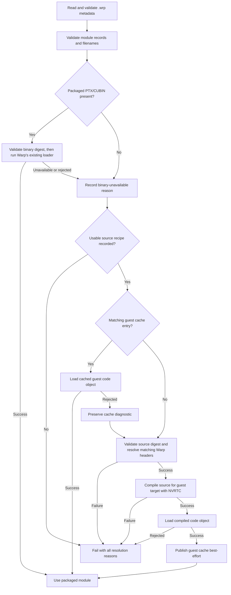

# Portable CUDA Replay for API Capture

**Status**: Proposed

**Issue**: [GH-1837](https://github.com/NVIDIA/warp/issues/1837)

## Motivation

API Capture (APIC) can serialize a CUDA graph to a ``.wrp`` file and reconstruct
it in another process. The serialized operation stream and memory regions are
relocatable, but the companion CUDA modules are not necessarily portable. Today
``capture_save()`` copies the PTX or CUBIN that was loaded while capturing, and
``capture_load()`` immediately loads that same code object. A CUBIN targets a
particular GPU architecture, while a PTX module can still be rejected when its
target or PTX ISA is unsupported by the guest driver. Consequently, a graph
captured on one system may fail to load on another system even when both GPUs
can run the generated CUDA source.

A representative deployment captures and saves on a desktop with a GeForce
5080 and transfers the resulting artifact to a Jetson Thor. The two GPUs are
from a similar generation but use different CUDA targets. Requiring the host
to know and precompile every guest target makes the capture artifact coupled to
the deployment fleet and prevents a standalone guest from recovering when none
of the packaged code objects is compatible.

Warp already retains generated ``.cu`` files in its kernel cache and embeds
NVRTC in CUDA-enabled native builds. This design makes that source part of the
APIC artifact and allows the guest to compile it for its local CUDA device when
the packaged PTX or CUBIN cannot be loaded. The same native implementation is
used by Python and standalone C++ loading.

This document extends the core APIC design in
[``api-capture-and-cpu-graphs.md``](api-capture-and-cpu-graphs.md). The APIC
operation stream, memory-region model, bindings, object reconstruction, and
lazy CUDA graph reconstruction remain unchanged.

## Terminology

- **Host**: The system that captures a graph and calls ``capture_save()``.
- **Guest**: The system that calls ``capture_load()`` or
  ``wp_apic_load_graph_ex()`` and replays the graph.
- **Packaged binary**: A PTX or CUBIN copied from the host kernel cache into the
  companion ``_modules`` directory.
- **Guest-cache entry**: A PTX or CUBIN compiled while loading on a guest and
  persisted in the companion ``_modules`` directory for subsequent loads.
- **Source fallback**: Guest-side compilation of packaged generated CUDA source
  after the packaged binary cannot be used.
- **Compile recipe**: Serializable metadata needed to compile a particular
  generated ``.cu`` file without the Python program that originally defined the
  kernels.

## Requirements

| ID | Requirement | Priority | Notes |
| --- | --- | --- | --- |
| R1 | Load a CUDA ``.wrp`` on a guest whose CUDA target differs from the host target | Must | Provided the recorded source and its dependencies support the guest |
| R2 | Prefer a compatible packaged PTX or CUBIN over compilation | Must | Existing same-system loads should keep their current latency |
| R3 | Compile packaged ``.cu`` source automatically when no packaged binary can be loaded | Must | Compilation targets the guest device |
| R4 | Implement module selection and compilation in the native loader | Must | Python and standalone C++ must have the same behavior |
| R5 | Preserve the current success conditions of ``capture_save()`` | Must | Failure to add a source fallback may warn but must not make an otherwise valid save fail |
| R6 | Report both the binary-load failure and the precise source-fallback failure | Must | Missing source, headers, compiler support, and link inputs require distinct diagnostics |
| R7 | Preserve the compilation options that affect kernel semantics | Must | Do not silently compile a materially different module on the guest |
| R8 | Keep generated source paired with the exact module variant used by capture | Must | A source file from another architecture-specific build is not an acceptable substitute |
| R9 | Persist successful guest compilations in the companion ``_modules`` directory when it is writable | Must | Cache publication is best-effort and must not prevent loading a read-only artifact |
| R10 | Validate packaged artifact names and content digests before loading or compiling each file | Must | Do not allow metadata-controlled paths to escape the companion directory |
| R11 | Require the writer and loader to use the same APIC format and Warp version | Must | Cross-version compatibility is not part of this proposal |
| R12 | Do not change CPU capture or CPU module portability | Must | CPU ``.o`` portability remains governed by the existing design |

**Non-goals:**

- Converting a CUDA APIC graph to CPU or vice versa.
- Making generated CUDA source independent of the Warp native headers and native
  library version used to compile it.
- Serializing the original Python module, arbitrary Python code, or enough
  Python state to run code generation again on the guest.
- Compiling generated source that depends on caller-provided third-party headers
  or libraries. Such modules remain binary-only in the first implementation.
- Falling back to nvcc. Guest compilation uses the NVRTC implementation embedded
  in the matching Warp native library.
- Making target-specific NVRTC, LLVM-CUDA, LTO-IR, fatbin, or MathDx link inputs
  portable in the first implementation.
- Guaranteeing that a graph supported by the host hardware is supported by a
  less capable guest. Source compilation addresses code-object compatibility,
  not missing device features or insufficient resources.

## Design

### Artifact model

A saved graph remains an artifact set rather than a single self-contained file:

```text
simulation.wrp
simulation_modules/
    wp_example_<hash>.sm<host>.cubin   # or .ptx; existing fast path
    wp_example_<hash>.sm<host>.cu      # exact generated source for that binary
    wp_example_<hash>.meta             # existing module metadata
    wp_example_<cache-key>.sm<guest>.cubin  # or .ptx; created on the guest
```

Guest-cache filenames are derived from validated metadata rather than added to
the ``.wrp``. Consequently, publishing a cache entry does not rewrite or
invalidate the captured artifact.

The ``.wrp`` metadata records the producer Warp version and identifies every
file; the loader does not select files by scanning extensions. Each CUDA module
record gains the following logical data:

- the packaged binary filename, kind (PTX or CUBIN), target architecture,
  architecture suffix, and SHA-256 digest;
- the generated source filename and SHA-256 digest, or an explicit indication
  that source was unavailable;
- an NVRTC compile recipe containing debug/release mode, optimization level,
  ``verify_fp``, ``fast_math``, ``fuse_fp``, line-information policy, and the
  requested architecture-suffix policy;
- flags describing external CUDA include dependencies, the compiler that
  produced the host binary, and whether target-specific LTO-IR or fatbin inputs
  were used.

The existing module ``target_arch`` must come from the retained
``ModuleExec.compile_arch`` rather than recomputing it from the graph's device
at save time. Global configuration may have changed since the module was
loaded, and different retained module variants must describe the code object
that was actually captured.

The exact packed representation will live in ``apic_types.h``. Adding these
fields changes serialized metadata, so the writer increments
``APIC_FORMAT_VERSION``. This proposal does not preserve a read window: the
loader requires the file's format version and producer Warp version to match
its own exactly. A mismatch fails before module loading or resource allocation.

### Recording the compile recipe

``capture_save()`` must not reconstruct a recipe by inspecting a filename or by
running code generation again. CUDA code generation may depend on the output
architecture, and some kernels add link inputs while their source is being
generated. In addition, the source file currently has an architecture-neutral
name in a directory shared by several binary variants, so a later compile can
leave source that does not correspond to the retained ``ModuleExec``.

The normal module-build path will therefore create a ``CudaCompileRecipe`` at
the same time as it generates source and native link inputs. A versioned,
per-variant private kernel-cache record associates the recipe and source digest
with the compiled binary, and ``ModuleExec`` retains that record after load.
This private record is not copied into the APIC artifact; ``.wrp`` metadata is
the artifact's only recipe contract. CUDA source cache filenames become
variant-specific, using the same target architecture and suffix as their
PTX/CUBIN, so two builds cannot overwrite or accidentally reuse each other's
source. ``APICapture`` collects the recipe from the exact ``ModuleExec`` used
by each recorded launch.

The recipe contains resolved compiler options, but not every setting belongs in
the same place. The implementation uses the following ownership split:

| State | Representation during guest compilation |
| --- | --- |
| Build mode, optimization level, ``verify_fp``, ``fast_math``, ``fuse_fp``, line information, and architecture-suffix policy | Serialized explicitly in the compile recipe |
| ``block_dim``, cluster declarations, generated preambles, deterministic instrumentation, and other code-generation choices | Frozen in the exact ``.cu`` source and existing APIC kernel/launch metadata; the loader validates consistency but does not regenerate them |
| Output architecture and PTX/CUBIN kind | Chosen for the guest device |
| PCH use, PCH directory, and compile-time tracing | Guest-owned performance and diagnostic policy; not replayed from the host |
| LLVM-CUDA provenance and non-empty LTO-IR/fatbin link inputs | Recorded as source-fallback blockers in the first version |

This distinction prevents accidental use of the guest's global semantic
configuration while avoiding redundant fields that could disagree with the
packaged source.

Source fallback is initially compilable only when the saved source can be
passed to the embedded NVRTC compiler without omitted target-specific link
inputs. A recipe is marked unavailable for first-version source fallback when,
for example:

- the module was loaded from a caller-supplied binary without matching source;
- the module was built with caller-provided CUDA include directories;
- the source was produced for the LLVM-CUDA path and is not known to be
  NVRTC-compatible; or
- code generation supplied LTO-IR or fatbin inputs that cannot be regenerated
  from the ``.cu`` alone. Current examples include MathDx-backed Tile GEMM,
  FFT, Cholesky, Cholesky-solve, and triangular-solve paths when they actually
  select their linked implementations.

The source may still be copied for inspection and future format support. These
conditions do not invalidate the packaged binary.

### Save behavior

``capture_save()`` continues to require and copy the compiled module binary as
it does today. For each CUDA module it also makes a best-effort copy of the
variant-specific source and registers the compile recipe with the native APIC
state.

Failure to copy source, absence of a recipe, use of external dependencies, or
an unsupported link-input/compiler recipe contributes to one aggregated
portability warning from ``capture_save()``. The warning groups affected
modules by reason instead of emitting once per module. The save continues and
produces binary-only records for modules without a usable fallback. Existing
save errors, such as a missing required binary, a failed memory snapshot, or a
non-serializable APIC operation, are unchanged; R5 does not suppress them.

Warnings distinguish these cases:

- source fallback is unavailable because generated source was not retained;
- source fallback is unavailable because the module uses external include
  dependencies; or
- source exists but first-version guest compilation cannot reproduce required
  compiler or link inputs.

This policy lets existing capture programs begin producing richer artifacts
without making previously valid saves fail.

### Load and module-resolution algorithm

Module resolution happens before device-memory allocation and CUDA graph
reconstruction. Each module is resolved independently, so a graph may use its
packaged binary for some modules and source fallback for others.



Warp's existing module loader is the authority on whether packaged PTX or CUBIN
is usable. For PTX, that path includes both the normal CUDA driver JIT and the
existing ``nvPTXCompiler``-to-CUBIN path used when the driver cannot consume the
toolkit's PTX directly. Source recompilation begins only after that complete
path fails. Metadata permits missing files and obvious mismatches to improve
diagnostics, but it must not replace the loader's compatibility behavior with
an incomplete architecture table. A corrupt or truncated binary is just as
recoverable as an architecture mismatch when valid source is available.

After the packaged binary path fails, the loader checks for a deterministic
guest-cache filename derived from the recorded recipe and the guest compilation
target. A valid cached code object avoids recompilation. If loading it fails,
the loader preserves that diagnostic and recompiles from source; a cache
failure never prevents an otherwise successful in-memory compilation.

The current module-load and NVRTC helpers print failures immediately. That is
incompatible with a successful, quiet fallback and with composing both causes
into one final error. Their shared implementation must expose non-reporting
operations that return a module or compiled bytes together with structured
status and log text. Existing public wrappers retain their current immediate
logging behavior; APIC holds the first diagnostic and emits nothing at error
level unless all permitted resolution paths fail.

Guest compilation chooses an output using the same policy as normal Warp
module loading:

1. Query the physical device architecture associated with the supplied CUDA
   context and the architectures supported by the embedded NVRTC.
2. Emit an exact-target CUBIN when NVRTC supports the guest architecture.
3. Otherwise emit PTX for an NVRTC-supported compute target accepted by the
   guest, using Warp's normal PTX-target policy.
4. Validate a recorded ``a`` or ``f`` architecture-suffix request against the
   guest target. A request that cannot be preserved is a clear load failure,
   not a silent downgrade.

Compiling and loading a module does not launch user work and is completed
before the loader allocates APIC regions. After every module is resolved, the
existing load path allocates memory, recreates supported objects, resolves
kernel functions, and lazily reconstructs the CUDA graph on first launch.

### Python and native APIs

Python keeps its existing public signature and forwards all work to the native
loader:

```python
def capture_load(
    path: str,
    device: DeviceLike = None,
) -> Graph: ...
```

Python supplies the installed Warp ``native`` include directory automatically.
CPU loading remains unchanged.

The experimental native API gains an additive entry point that accepts the one
piece of installation state the native library cannot discover reliably:

```cpp
WP_API APICGraph* wp_apic_load_graph_ex(
    void* context,
    const char* path,
    int device_type,
    const char* warp_include_dir);
```

``wp_apic_load_graph()`` remains binary-only: it can use the packaged binary or
a previously published guest-cache entry, but cannot invoke NVRTC. Existing
binary-compatible standalone applications therefore keep working. A standalone
application that wants source fallback calls ``wp_apic_load_graph_ex()`` and
provides the Warp native-header directory corresponding to its linked library.
The standalone APIC example will demonstrate this path. If no binary loads and
the header directory was not provided, the loader reports that source fallback
was unavailable rather than obscuring the binary-load error.

The native loader owns binary selection, recipe validation, compilation, and
CUDA module loading. Python must not precompile a replacement
and then call a separate binary-only path, because that would give standalone
C++ different compatibility and error behavior.

### Headers and external dependencies

Generated CUDA source includes Warp headers such as ``builtin.h`` and
``deterministic.h``. Python knows their installed location. A standalone caller
must provide it through ``wp_apic_load_graph_ex()``. The supplied
headers must come from the same Warp installation as the guest native library.
The ``.wrp`` records the producer Warp version, and the loader requires an exact
match before using either packaged source or binaries. Supporting generated
source or recorded programs across Warp versions is deferred.

Third-party dependencies are not copied or resolved in the first
implementation. Copying arbitrary include trees would make artifact size,
licensing, secrets, and transitive dependency behavior surprising. A module
built with caller-provided CUDA include directories is marked binary-only.
When its packaged binary cannot load, APIC reports the module name, the prior
binary-load failure, and the external-include limitation rather than attempting
a compile that cannot be reproduced reliably.

Target-specific link inputs are different from headers. The first version does
not serialize or regenerate LTO-IR and fatbins. When a recipe declares them and
the packaged binary cannot load, the loader reports that the source is present
but insufficient and names the unsupported dependency class. ``capture_save()``
only warns about this portability limitation.

### Compilation output and persistent cache

The native NVRTC implementation exposes an internal compile-to-memory path
factored from ``wp_cuda_compile_program()``, and APIC loads the returned bytes
directly. After the module loads successfully, APIC also publishes those bytes
to the companion ``_modules`` directory when it is writable. A later load can
reuse this guest code object without invoking NVRTC.

The cache key includes the module and source digests, semantic compile-recipe
fields, exact Warp version, NVRTC version, and output architecture, kind, and
suffix. It produces a deterministic relative basename; no cache-controlled or
metadata-controlled path may escape ``_modules``. Cache files are written to
process- and thread-specific temporary names and atomically published only
after compilation and module loading succeed. Concurrent writers may reuse the
entry that wins publication.

A missing, truncated, or unloadable cache entry is ignored, rebuilt from source,
and replaced atomically when possible. Cache publication failure produces at
most a warning and does not fail a successfully compiled load. The transferred
directory may therefore remain read-only, in which case APIC compiles and loads
in memory on each load without changing the artifact.

### Validation, diagnostics, and cleanup

New-format module filenames must be relative basenames. After joining a name to
the companion directory, the normalized path must remain inside that directory.
Absolute names, parent traversal, embedded separators where a
basename is required, duplicate module hashes with conflicting recipes, and
digest mismatches fail before module load or compilation.

The loader retains the first packaged-binary error while attempting source
fallback. If fallback also fails, the final diagnostic contains both causes in
this order:

1. packaged artifact and CUDA driver rejection;
2. cached guest code-object rejection, when an entry was present;
3. source fallback availability and policy;
4. Warp version, header, external dependency, NVRTC, or freshly compiled
   code-object load failure; and
5. host target, guest target, producer Warp version, and guest Warp version.

Normal fallback is not logged as an error when compilation succeeds. An
informational message may identify that a module was compiled for the guest or
loaded from the persistent guest cache.

Module setup remains transactional. A failure unloads all CUDA modules already
selected or compiled for the partially constructed ``APICGraph`` and removes
temporary compilation and cache files. Successfully published cache entries
remain available. Device memory is allocated only after modules resolve,
minimizing cleanup work and avoiding partially initialized graphs.

Loading generated source does not introduce a new trust boundary: a ``.wrp``
artifact already carries native GPU code that the loader executes. APIC files
and their companion directories remain trusted inputs. Digest and path checks
protect artifact consistency and filesystem boundaries; they do not sandbox
the CUDA program.

### Compatibility and rollout

The reader accepts only its current ``APIC_FORMAT_VERSION`` and a file produced
by the exact same Warp version. There is no legacy read window, version-dependent
module default, or source-compatibility negotiation in this proposal. Users
must regenerate captures after changing Warp versions.

For a CUDA graph, the captured target architecture is provenance and a
packaged-binary hint, not a requirement that the guest have the same
architecture. New files whose source copy or recipe was unavailable remain
binary-only. This produces four expected outcomes:

| Artifact and guest | Outcome |
| --- | --- |
| Packaged binary loads | Use it; do not inspect or compile source |
| Packaged binary fails and matching guest cache loads | Use the cached code object |
| Binaries fail and usable source recipe is present | Compile for the guest, publish the result best-effort, then continue loading |
| Binary fails and source/dependencies are unavailable | Fail with both the binary and source-fallback reasons |

The implementation must update the APIC user guide, the standalone CUDA
example, and the core APIC design's deferred-compilation and portability
sections when this proposal moves to Implemented.

### What does not change

- The APIC operation stream, memory-region model, bindings, object
  reconstruction, and lazy CUDA graph reconstruction are unchanged.
- CPU capture and CPU ``.o`` loading retain their current behavior and
  portability limits.
- Live CUDA graphs continue to launch the native graph produced during capture.
- Same-target saved graphs continue through the packaged-binary path without
  invoking source compilation.
- The existing PTX loader keeps its driver-JIT and ``nvPTXCompiler`` behavior;
  source compilation is an additional last resort.

## Implementation Plan

The implementation proceeds native-first. There is one APIC CUDA module
resolver in the native library; Python supplies installation-specific inputs
and calls that resolver rather than implementing its own retry, compilation,
or cache policy. Each phase leaves the tree buildable and has an explicit
completion gate.

### Phase 1: Retain exact capture-time source and recipes

1. Add a native-serializable ``CudaCompileRecipe`` representation for the
   semantic NVRTC options listed in the design. Use fixed-width fields and
   validated enums rather than a language-specific sidecar format.
2. Extend ``ModuleExec`` in ``warp/_src/context.py`` to retain the recipe,
   source path and digest, output kind, compile architecture, architecture
   suffix, compiler provenance, and source-fallback blockers created during
   the build that produced that executable.
3. Make CUDA source cache filenames variant-specific. Source produced for one
   architecture/suffix variant must not overwrite or stand in for another
   retained ``ModuleExec``.
4. Update ``warp/_src/apic/capture.py`` to collect metadata from the exact
   retained ``ModuleExec`` instead of resolving current module or global
   options during capture or save.
5. Keep the compiled binary mandatory during ``capture_save()``. Copy source
   and register its recipe best-effort, collecting one warning grouped by
   module and reason when a fallback cannot be exported. Optional source work
   must not introduce a new save failure.

Completion gate: compiling two variants of one module and changing global
configuration after capture cannot change which source, recipe, or binary is
exported for either captured ``ModuleExec``.

### Phase 2: Add the versioned wire contract

1. Extend the APIC module record in ``warp/native/apic_types.h`` with the
   packaged-binary properties, source filename and digest, compile recipe, and
   explicit fallback-availability reason.
2. Record the producer Warp version and increment ``APIC_FORMAT_VERSION``.
   Reject any APIC format or Warp version mismatch before module or resource
   setup; no compatibility window is required.
3. Update the writer and reader in ``warp/native/apic.cpp`` with bounded parsing
   and validation for every new field. Module and source filenames are relative
   basenames, and conflicting duplicate records are invalid.
4. Keep source and recipe associations inside ``.wrp`` metadata. Do not scan
   ``_modules`` for source files or introduce an unversioned JSON recipe.

Completion gate: format tests pin the new layout and reject malformed recipes,
digest mismatches, path traversal, duplicate conflicts, and version mismatch
before CUDA modules or APIC memory are created.

### Phase 3: Factor native load and compilation primitives

1. Refactor the CUDA module-loading implementation in ``warp/native/warp.cu``
   into a non-reporting internal operation that returns either a loaded module
   or a structured status and diagnostic. Preserve the existing public
   wrapper's immediate logging behavior.
2. Preserve the full existing PTX path, including CUDA driver JIT and the
   ``nvPTXCompiler``-to-CUBIN fallback. APIC source compilation is attempted
   only after that complete path rejects the packaged object.
3. Factor NVRTC compilation into an internal compile-to-memory operation that
   accepts the recorded recipe and returns PTX/CUBIN bytes plus the compiler
   log. Keep ``wp_cuda_compile_program()`` as a file-output wrapper so existing
   callers are unchanged.
4. Reuse one native target-selection helper for APIC. It selects the guest
   architecture and output kind from the CUDA context, embedded NVRTC, and
   driver, then validates the recorded architecture-suffix requirement.

Completion gate: focused native tests can independently obtain and inspect
packaged-load, cached-load, NVRTC, and compiled-code-object-load failures
without emitting an error from a path that later recovers.

### Phase 4: Implement the native per-module resolver

1. Introduce an internal load configuration containing the optional matching
   Warp native-header directory and whether source compilation is available.
2. Resolve every CUDA module before APIC memory allocation:

   - validate and try the packaged PTX/CUBIN through the existing complete
     loader;
   - derive and try the deterministic guest-cache entry;
   - if necessary, validate source, recipe, headers, and fallback eligibility;
   - compile to memory for the guest and load those bytes; and
   - only after a successful load, publish the bytes to ``_modules``
     best-effort.

3. Derive the guest-cache key from the module and source digests, semantic
   recipe, exact Warp and NVRTC versions, and output architecture, kind, and
   suffix. Use process- and thread-specific temporary names followed by atomic
   replacement.
4. Treat a missing, corrupt, or unloadable cache entry as a cache miss. A
   read-only artifact or cache-publication failure still succeeds through the
   in-memory module.
5. Preserve diagnostics from every attempted resolution path. Report the
   combined causes only if all permitted paths fail, and unload modules already
   resolved for a partially constructed graph.
6. Mark caller-provided CUDA includes, LLVM-CUDA source, and non-empty LTO-IR
   or fatbin inputs as binary-only for this implementation. Report the blocker
   without attempting an incomplete compilation.

Completion gate: a graph with multiple modules can mix packaged, cached, and
newly compiled modules in one load, and failure of any later module releases
all modules selected earlier without allocating APIC memory.

### Phase 5: Expose one loader to C++ and Python

1. Implement ``wp_apic_load_graph_ex()`` in ``warp/native/apic.h`` as a call to
   the same internal graph loader used by ``wp_apic_load_graph()``. The existing
   function remains source-compilation-disabled for compatibility but may use a
   valid packaged or guest-cache binary.
2. Register the additive function with ctypes in ``warp/_src/context.py``.
   CUDA ``capture_load()`` calls it once and supplies the installed Warp
   ``native`` header directory; CPU loading retains its current path.
3. Do not add a Python module scanner or Python recompilation retry. Target
   selection, fallback ordering, caching, diagnostics, and CUDA module lifetime
   remain native-owned for both callers.
4. Update ``warp/examples/cpp/02_apic_visualization`` to pass its matching Warp
   header directory and demonstrate the source-fallback path.

Completion gate: the same artifact fixture produces the same selected module,
cache filename, and final diagnostic through Python ``capture_load()`` and a
standalone C++ call to ``wp_apic_load_graph_ex()``.

### Phase 6: Verify and document the completed feature

1. Implement the Python, native/standalone, format, validation, cache, and
   concurrency coverage in the Testing Strategy below. Tests that simulate an
   incompatible packaged binary must assert which compiled or cached object the
   native resolver actually loaded; same-device filename replacement is not an
   adequate cross-device test.
2. Build the native library after the C++/CUDA changes and run the focused APIC
   suites on CUDA and CPU. Build and run the standalone fallback smoke case
   without importing Python.
3. Perform at least one release-qualification transfer from a supported desktop
   GPU to a supported Jetson target, exercising both Python and standalone C++
   replay and then cache reuse.
4. Update the APIC user guide, standalone example documentation, and the core
   APIC design's portability sections. Add one changelog fragment describing
   both Python and standalone behavior.
5. Change this document's status to Implemented only after all Must
   requirements and both language paths pass their completion gates.

## Alternatives Considered

### Store the artifact recipe in a JSON sidecar

A ``.compile.json`` file shipped beside each module would avoid changing the
``.wrp`` bytes and would let an older loader ignore the new capability. That
compatibility is not required: writer and loader versions must match. Keeping
the artifact recipe in ``.wrp`` metadata binds it to the module hash and
filenames, reuses the native versioned parser, and avoids adding a JSON parser
or a second compatibility contract to standalone C++ loading. The internal
Python kernel cache may use a versioned per-variant record to retain build-time
provenance; standalone loading never reads it.

### Always compile source on the guest

Always compiling has simple compatibility semantics but adds load latency and a
runtime compiler dependency to every deployment. It also discards a valid
binary already paid for on same-target systems. Trying the packaged code object
first preserves current behavior and pays compilation cost only when needed.

### Package only source

A source-only artifact is smaller than source plus several binaries in some
cases and guarantees guest compilation, but it makes every load depend on
NVRTC and matching headers. Keeping the captured binary provides the most
reliable and fastest path for the common case.

### Require host-side AOT compilation for every guest

The host could receive a list of deployment architectures and package one code
object per target. This is useful as an optional future optimization, but it
requires the host toolkit to understand every guest target and makes artifacts
fleet-specific. It does not recover from a PTX ISA or driver mismatch that the
host did not anticipate.

### Perform fallback in Python

Python can call the existing module compiler easily, but standalone C++ is an
explicit APIC use case and has no Python module objects. Two loaders would also
drift in target selection and diagnostics. The native loader already
owns the loaded-module lifetime and embeds NVRTC, so it is the shared boundary.

### Run Python code generation again on the guest

Re-running code generation could recreate target-specific MathDx/LTO inputs,
but it would require serializing the original Python program, closures, static
expressions, extension registrations, and build environment. Generated CUDA
source is the intended portable boundary; modules that require omitted link
inputs remain binary-only until those inputs gain an explicit wire contract.

### Embed all Warp and third-party headers in the artifact

Bundling headers would make the native API more self-contained, but it would
duplicate a large part of Warp in every artifact and could silently redistribute
third-party or proprietary headers. Using the headers that correspond to the
exactly matching guest Warp installation keeps ownership explicit. Support for
application-controlled dependencies is deferred.

### Treat architecture metadata as a complete compatibility test

Simple comparisons work for exact-target CUBINs but do not capture PTX ISA,
driver, architecture-suffix, or CUDA compatibility behavior. The driver load is
authoritative. Metadata remains valuable for diagnostics and for avoiding
obviously irrelevant candidates, but a successful driver load decides the fast
path.

## Testing Strategy

### Python tests

- Save and load on the same CUDA device with invalid or absent packaged source;
  loading must succeed through the packaged binary and must not invoke NVRTC.
- Replace or select a packaged code object that the test device cannot load,
  retain valid source, and verify automatic compilation and graph replay.
- Load the artifact again and verify that it uses the guest code object
  published in ``_modules`` without invoking NVRTC. Corrupt that entry and
  verify that APIC recompiles it rather than failing the graph load.
- Cover PTX and CUBIN packaged fast paths independently.
- For PTX, cover both the driver-JIT path and the existing
  ``nvPTXCompiler``-to-CUBIN compatibility path; neither may trigger source
  recompilation when it succeeds.
- Save a module using a caller-provided CUDA include directory and verify that
  it is marked binary-only. If its binary cannot load, the error must name the
  module, the prior binary failure, and the unsupported external dependency.
- Save modules with absent source, external includes, LLVM-CUDA provenance, and
  LTO/fatbin inputs. Saving must not newly fail; warnings and load-time fallback
  errors must identify the limitation, and save emits one aggregated warning.
- Change semantic compiler flags and assert that the recorded recipes and guest
  cache keys differ.
- Build two architecture variants of one module and verify each APIC capture
  exports the source paired with its retained ``ModuleExec``.
- Verify successful source fallback does not emit the rejected packaged
  binary's diagnostic to stderr.

### Native and standalone tests

- Extend ``02_apic_visualization`` with a smoke mode that calls
  ``wp_apic_load_graph_ex()`` and supplies Warp's native include directory.
- Force its packaged module to be incompatible or unavailable, then verify that
  the executable compiles, loads, reconstructs, and launches the graph without
  Python.
- Run the native smoke test with a read-only artifact directory to cover
  compile-to-memory behavior.
- Simulate cache publication failure and verify that a successfully compiled
  graph still loads.
- Verify cleanup after the second of several modules fails to compile.
- Run concurrent loads of the same source recipe and verify atomic guest-cache
  publication.

### Format and validation tests

- Pin the new module-record layout and the format-version transition.
- Reject any APIC format or producer Warp version mismatch before module or
  memory setup.
- Reject truncated recipes, invalid enums and flag combinations, duplicate
  conflicting module records, digest mismatches, absolute filenames, and parent
  traversal.
- Mock binary rejection, unsupported dependency, and NVRTC failure
  independently so the composed diagnostic retains every relevant cause.

Hardware CI does not need every host/guest pair. Most policy tests can package
an intentionally unloadable binary and compile the valid source for the device
running the test. At least one release qualification run should transfer a real
artifact between different supported GPU targets and exercise both Python and
standalone C++ replay.
