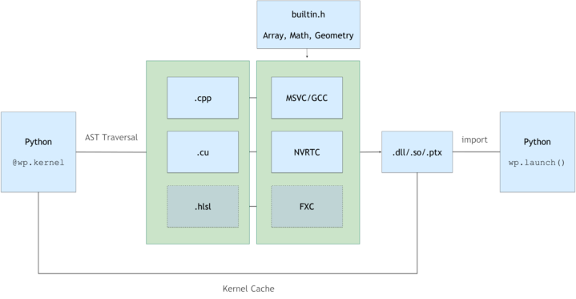

Basics
======

Initialization
--------------

Before use Warp should be explicitly initialized with the ``wp.init()`` method as follows::

    import warp as wp

    wp.init()

Warp will print some startup information about the compute devices available, driver versions, and the location
for any generated kernel code, e.g.:

.. code:: bat

    Warp 1.0.0 initialized:
    CUDA Toolkit: 11.8, Driver: 12.1
    Devices:
        "cpu"    | AMD64 Family 25 Model 33 Stepping 0, AuthenticAMD
        "cuda:0" | NVIDIA GeForce RTX 4080 (sm_89)
    Kernel cache: C:\Users\mmacklin\AppData\Local\NVIDIA Corporation\warp\Cache\1.0.0

Kernels
-------

In Warp, compute kernels are defined as Python functions and annotated with the ``@wp.kernel`` decorator, as follows::

    @wp.kernel
    def simple_kernel(a: wp.array(dtype=wp.vec3),
                      b: wp.array(dtype=wp.vec3),
                      c: wp.array(dtype=float)):

        # get thread index
        tid = wp.tid()

        # load two vec3s
        x = a[tid]
        y = b[tid]

        # compute the dot product between vectors
        r = wp.dot(x, y)

        # write result back to memory
        c[tid] = r

Because Warp kernels are compiled to native C++/CUDA code, all the function input arguments must be statically typed. This allows 
Warp to generate fast code that executes at essentially native speeds. Because kernels may be run on either the CPU
or GPU, they cannot access arbitrary global state from the Python environment. Instead they must read and write data
through their input parameters such as arrays.

Warp kernels functions have a 1:1 correspondence with CUDA kernels, to launch a kernel with 1024 threads, we use
:func:`wp.launch() <warp.launch>` as follows::

    wp.launch(kernel=simple_kernel, # kernel to launch
              dim=1024,             # number of threads
              inputs=[a, b, c],     # parameters
              device="cuda")        # execution device

Inside the kernel we can retrieve the *thread index* of the each thread using the ``wp.tid()`` builtin function::

    # get thread index
    i = wp.tid()

Kernels can be launched with 1D, 2D, 3D, or 4D grids of threads, e.g.: to launch a 2D grid of threads to process a 1024x1024 image we could write::

    wp.launch(kernel=compute_image, 
              dim=(1024, 1024),       
              inputs=[img],     
              device="cuda")

Then, inside the kernel we can retrieve a 2D thread index as follows::

    # get thread index
    i, j = wp.tid()

    # write out a color value for each pixel
    color[i, j] = wp.vec3(r, g, b)

.. _example-cache-management:

Example: Changing the kernel cache directory
^^^^^^^^^^^^^^^^^^^^^^^^^^^^^^^^^^^^^^^^^^^^

The following example illustrates how the location for generated and compiled
kernel code can be changed before and after calling ``wp.init()``.

.. code:: python

    import os

    import warp as wp

    example_dir = os.path.dirname(os.path.realpath(__file__))

    # set default cache directory before wp.init()
    wp.config.kernel_cache_dir = os.path.join(example_dir, "tmp", "warpcache1")

    wp.init()

    print("+++ Current cache directory: ", wp.config.kernel_cache_dir)

    # change cache directory after wp.init()
    wp.build.init_kernel_cache(os.path.join(example_dir, "tmp", "warpcache2"))

    print("+++ Current cache directory: ", wp.config.kernel_cache_dir)

    # clear kernel cache (forces fresh kernel builds every time)
    wp.build.clear_kernel_cache()

    @wp.kernel
    def basic(x: wp.array(dtype=float)):
        tid = wp.tid()
        x[tid] = float(tid)

    device = "cpu"
    n = 10
    x = wp.zeros(n, dtype=float, device=device)

    wp.launch(kernel=basic, dim=n, inputs=[x], device=device)
    print(x.numpy())

Arrays
------

Memory allocations are exposed via the ``wp.array`` type. Arrays wrap an underlying memory allocation that may live in
either host (CPU), or device (GPU) memory. Arrays are strongly typed and store a linear sequence of built-in values
(``float,``, ``int``, ``vec3``, ``matrix33``, etc).

Arrays can be allocated similar to PyTorch::

    # allocate an uninitialized array of vec3s
    v = wp.empty(shape=n, dtype=wp.vec3, device="cuda")

    # allocate a zero-initialized array of quaternions    
    q = wp.zeros(shape=n, dtype=wp.quat, device="cuda")

    # allocate and initialize an array from a NumPy array
    # will be automatically transferred to the specified device
    a = np.ones((10, 3), dtype=np.float32)
    v = wp.from_numpy(a, dtype=wp.vec3, device="cuda")

By default, Warp arrays that are initialized from external data (e.g.: NumPy, Lists, Tuples) will create a copy the data to new memory for the
device specified. However, it is possible for arrays to alias external memory using the ``copy=False`` parameter to the
array constructor provided the input is contiguous and on the same device. See the :doc:`/modules/interoperability`
section for more details on sharing memory with external frameworks.

To read GPU array data back to CPU memory we can use the ``array.numpy()`` method::

    # bring data from device back to host
    view = device_array.numpy()

This will automatically synchronize with the GPU to ensure that any outstanding work has finished, and will
copy the array back to CPU memory where it is passed to NumPy. Calling ``array.numpy()`` on a CPU array will return
a zero-copy NumPy view onto the Warp data.

User Functions
--------------

Users can write their own functions using the ``@wp.func`` decorator, for example::

    @wp.func
    def square(x: float):
        return x*x

User functions can be called freely from within kernels inside the same module and accept arrays as inputs. 

Compilation Model
-----------------

Warp uses a Python->C++/CUDA compilation model that generates kernel code from Python function definitions. All kernels belonging to a Python module are runtime compiled into dynamic libraries and PTX, the result is then cached between application restarts for fast startup times.

Note that compilation is triggered on the first kernel launch for that module. Any kernels registered in the module with ``@wp.kernel`` will be included in the shared library.

Language Details
----------------

To support GPU computation and differentiability, there are some differences from the CPython runtime.

Built-in Types
^^^^^^^^^^^^^^

Warp supports a number of built-in math types similar to high-level shading languages, for example ``vec2, vec3, vec4, mat22, mat33, mat44, quat, array``. All built-in types have value semantics so that expressions such as ``a = b`` generate a copy of the variable b rather than a reference.

Strong Typing
^^^^^^^^^^^^^

Unlike Python, in Warp all variables must be typed. Types are inferred from source expressions and function signatures using the Python typing extensions. All kernel parameters must be annotated with the appropriate type, for example: ::

    @wp.kernel
    def simple_kernel(a: wp.array(dtype=vec3),
                      b: wp.array(dtype=vec3),
                      c: float):

Tuple initialization is not supported, instead variables should be explicitly typed: ::

    # invalid
    a = (1.0, 2.0, 3.0)        

    # valid
    a = wp.vec3(1.0, 2.0, 3.0) 

Limitations and Unsupported Features
^^^^^^^^^^^^^^^^^^^^^^^^^^^^^^^^^^^^

See :doc:`limitations` for a list of Warp limitations and unsupported features.
