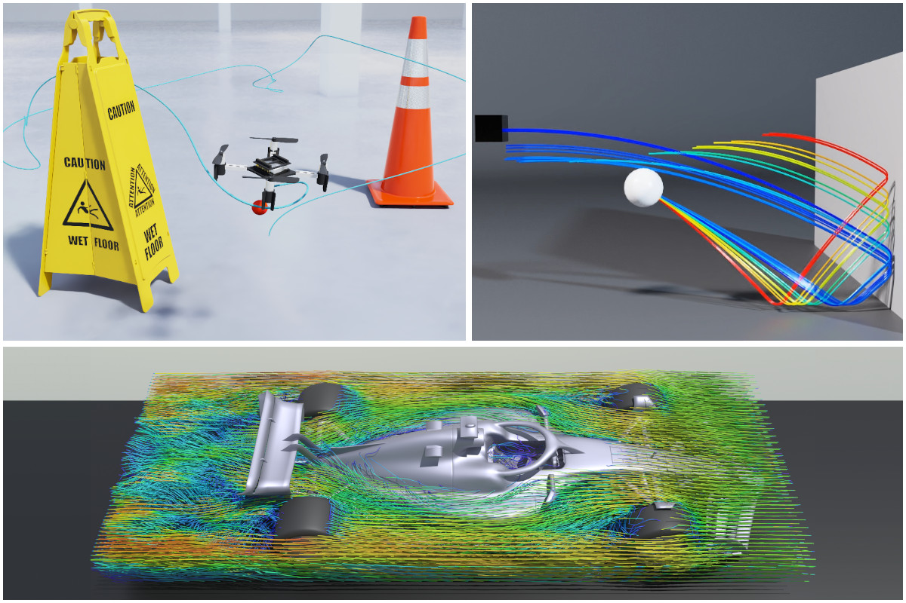

NVIDIA Warp Documentation
=========================

Warp is a Python framework for GPU-accelerated simulation, robotics, and machine learning. Warp takes
regular Python functions and JIT compiles them to efficient kernel code that can run on the CPU or GPU.

Warp comes with a rich set of primitives for physics simulation, robotics, geometry processing,
and more. Warp kernels are differentiable and can be used as part of machine-learning pipelines
with frameworks such as PyTorch, JAX and Paddle.

Quickstart
----------

Install Warp from `PyPI <https://pypi.org/project/warp-lang>`_:

.. code-block:: sh

    $ pip install warp-lang

For conda, nightly builds, CUDA 13 builds, building from source, and driver requirements,
see :doc:`user_guide/installation`.

Example Gallery
---------------

The `warp/examples <https://github.com/NVIDIA/warp/tree/main/warp/examples>`_ directory
contains examples covering physics simulation, geometry processing, optimization, and
tile-based GPU programming. Install the optional dependencies with
``pip install warp-lang[examples]`` and run them from the command line::

    python -m warp.examples.<example_subdir>.<example>

warp/examples/core
^^^^^^^^^^^^^^^^^^

.. list-table::
    :widths: 25 25 25 25
    :class: gallery

    * - .. image:: ./img/examples/core_dem.png
           :target: https://github.com/NVIDIA/warp/blob/main/warp/examples/core/example_dem.py
      - .. image:: ./img/examples/core_fluid.png
           :target: https://github.com/NVIDIA/warp/blob/main/warp/examples/core/example_fluid.py
      - .. image:: ./img/examples/core_graph_capture.png
           :target: https://github.com/NVIDIA/warp/blob/main/warp/examples/core/example_graph_capture.py
      - .. image:: ./img/examples/core_marching_cubes.png
           :target: https://github.com/NVIDIA/warp/blob/main/warp/examples/core/example_marching_cubes.py
    * - dem
      - fluid
      - graph capture
      - marching cubes
    * - .. image:: ./img/examples/core_mesh.png
           :target: https://github.com/NVIDIA/warp/blob/main/warp/examples/core/example_mesh.py
      - .. image:: ./img/examples/core_nvdb.png
           :target: https://github.com/NVIDIA/warp/blob/main/warp/examples/core/example_nvdb.py
      - .. image:: ./img/examples/core_raycast.png
           :target: https://github.com/NVIDIA/warp/blob/main/warp/examples/core/example_raycast.py
      - .. image:: ./img/examples/core_raymarch.png
           :target: https://github.com/NVIDIA/warp/blob/main/warp/examples/core/example_raymarch.py
    * - mesh
      - nvdb
      - raycast
      - raymarch
    * - .. image:: ./img/examples/core_sample_mesh.png
           :target: https://github.com/NVIDIA/warp/blob/main/warp/examples/core/example_sample_mesh.py
      - .. image:: ./img/examples/core_sph.png
           :target: https://github.com/NVIDIA/warp/blob/main/warp/examples/core/example_sph.py
      - .. image:: ./img/examples/core_torch.png
           :target: https://github.com/NVIDIA/warp/blob/main/warp/examples/core/example_torch.py
      - .. image:: ./img/examples/core_wave.png
           :target: https://github.com/NVIDIA/warp/blob/main/warp/examples/core/example_wave.py
    * - sample_mesh
      - sph
      - torch
      - wave
    * - .. image:: ./img/examples/core_fft_poisson_navier_stokes_2d.png
           :target: https://github.com/NVIDIA/warp/blob/main/warp/examples/core/example_fft_poisson_navier_stokes_2d.py
      -
      -
      -
    * - 2-D incompressible turbulence in a periodic box
      -
      -
      -

warp/examples/fem
^^^^^^^^^^^^^^^^^

.. list-table::
    :widths: 25 25 25 25
    :class: gallery

    * - .. image:: ./img/examples/fem_diffusion_3d.png
           :target: https://github.com/NVIDIA/warp/blob/main/warp/examples/fem/example_diffusion_3d.py
      - .. image:: ./img/examples/fem_mixed_elasticity.png
           :target: https://github.com/NVIDIA/warp/blob/main/warp/examples/fem/example_mixed_elasticity.py
      - .. image:: ./img/examples/fem_apic_fluid.png
           :target: https://github.com/NVIDIA/warp/blob/main/warp/examples/fem/example_apic_fluid.py
      - .. image:: ./img/examples/fem_streamlines.png
           :target: https://github.com/NVIDIA/warp/blob/main/warp/examples/fem/example_streamlines.py
    * - diffusion 3d
      - mixed elasticity
      - apic fluid
      - streamlines
    * - .. image:: ./img/examples/fem_distortion_energy.png
           :target: https://github.com/NVIDIA/warp/blob/main/warp/examples/fem/example_distortion_energy.py
      - .. image:: ./img/examples/fem_taylor_green.png
           :target: https://github.com/NVIDIA/warp/blob/main/warp/examples/fem/example_taylor_green.py
      - .. image:: ./img/examples/fem_kelvin_helmholtz.png
           :target: https://github.com/NVIDIA/warp/blob/main/warp/examples/fem/example_kelvin_helmholtz.py
      - .. image:: ./img/examples/fem_magnetostatics.png
           :target: https://github.com/NVIDIA/warp/blob/main/warp/examples/fem/example_magnetostatics.py
    * - distortion energy
      - taylor green
      - kelvin helmholtz
      - magnetostatics
    * - .. image:: ./img/examples/fem_adaptive_grid.png
           :target: https://github.com/NVIDIA/warp/blob/main/warp/examples/fem/example_adaptive_grid.py
      - .. image:: ./img/examples/fem_nonconforming_contact.png
           :target: https://github.com/NVIDIA/warp/blob/main/warp/examples/fem/example_nonconforming_contact.py
      - .. image:: ./img/examples/fem_darcy_ls_optimization.png
           :target: https://github.com/NVIDIA/warp/blob/main/warp/examples/fem/example_darcy_ls_optimization.py
      - .. image:: ./img/examples/fem_elastic_shape_optimization.png
           :target: https://github.com/NVIDIA/warp/blob/main/warp/examples/fem/example_elastic_shape_optimization.py
    * - adaptive grid
      - nonconforming contact
      - darcy level-set optimization
      - elastic shape optimization

warp/examples/optim
^^^^^^^^^^^^^^^^^^^

.. list-table::
    :widths: 25 25 25 25
    :class: gallery

    * - .. image:: ./img/examples/optim_diffray.png
           :target: https://github.com/NVIDIA/warp/blob/main/warp/examples/optim/example_diffray.py
      - .. image:: ./img/examples/optim_fluid_checkpoint.png
           :target: https://github.com/NVIDIA/warp/blob/main/warp/examples/optim/example_fluid_checkpoint.py
      - .. image:: ./img/examples/optim_particle_repulsion.png
           :target: https://github.com/NVIDIA/warp/blob/main/warp/examples/optim/example_particle_repulsion.py
      - .. image:: ./img/examples/optim_navier_stokes_perturbation.png
           :target: https://github.com/NVIDIA/warp/blob/main/warp/examples/optim/example_navier_stokes_perturbation.py
    * - diffray
      - fluid checkpoint
      - particle repulsion
      - navier-stokes perturbation

warp/examples/tile
^^^^^^^^^^^^^^^^^^

.. list-table::
    :widths: 25 25 25 25
    :class: gallery

    * - .. image:: ./img/examples/tile_mlp.png
            :target: https://github.com/NVIDIA/warp/blob/main/warp/examples/tile/example_tile_mlp.py
      - .. image:: ./img/examples/tile_nbody.png
            :target: https://github.com/NVIDIA/warp/blob/main/warp/examples/tile/example_tile_nbody.py
      - .. image:: ./img/examples/tile_mcgp.png
            :target: https://github.com/NVIDIA/warp/blob/main/warp/examples/tile/example_tile_mcgp.py
      -
    * - mlp
      - nbody
      - mcgp
      -

.. toctree::
    :maxdepth: 2
    :caption: User Guide

    user_guide/installation
    user_guide/basics
    user_guide/runtime
    user_guide/devices
    user_guide/differentiability
    user_guide/generics
    user_guide/tiles
    user_guide/interoperability
    user_guide/configuration
    user_guide/debugging
    user_guide/limitations
    user_guide/contribution_guide
    user_guide/publications
    user_guide/compatibility
    user_guide/faq
    user_guide/changelog

.. toctree::
    :maxdepth: 2
    :caption: Deep Dive

    deep_dive/codegen
    deep_dive/allocators
    deep_dive/concurrency
    deep_dive/profiling

.. toctree::
    :maxdepth: 2
    :caption: Domain Modules

    domain_modules/sparse
    domain_modules/fem
    domain_modules/render

.. toctree::
    :maxdepth: 1
    :caption: API Reference

    api_reference/warp
    api_reference/warp_autograd
    api_reference/warp_config
    api_reference/warp_fem
    api_reference/warp_jax_experimental
    api_reference/warp_optim
    api_reference/warp_render
    api_reference/warp_sparse
    api_reference/warp_types
    api_reference/warp_utils

.. toctree::
    :maxdepth: 2
    :caption: Language Reference

    language_reference/builtins

.. toctree::
    :hidden:
    :caption: Project Links

    GitHub <https://github.com/NVIDIA/warp>
    PyPI <https://pypi.org/project/warp-lang>

:ref:`Full Index <genindex>`
