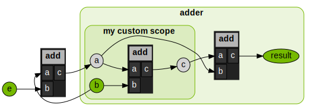

Differentiability
=================

.. currentmodule:: warp

By default, Warp generates a forward and backward (adjoint) version of each kernel definition. The backward version of a kernel can be used 
to compute gradients of loss functions that can be back propagated to machine learning frameworks like PyTorch.

Arrays that participate in the chain of computation which require gradients should be created with ``requires_grad=True``, for example::

    a = wp.zeros(1024, dtype=wp.vec3, device="cuda", requires_grad=True)

The ``wp.Tape`` class can then be used to record kernel launches, and replay them to compute the gradient of a scalar loss function with respect to the kernel inputs::

    tape = wp.Tape()

    # forward pass
    with tape:
        wp.launch(kernel=compute1, inputs=[a, b], device="cuda")
        wp.launch(kernel=compute2, inputs=[c, d], device="cuda")
        wp.launch(kernel=loss, inputs=[d, l], device="cuda")

    # reverse pass
    tape.backward(l)

After the backward pass has completed, the gradients with respect to the inputs are available from the ``array.grad`` attribute::

    # gradient of loss with respect to input a
    print(a.grad)

Note that gradients are accumulated on the participating buffers, so if you wish to reuse the same buffers for multiple backward passes you should first zero the gradients::

    tape.zero()

.. autoclass:: Tape
    :members:

Copying is Differentiable
#########################

``wp.copy()``, ``wp.clone()``, and ``array.assign()`` are differentiable functions and can participate in the computation graph recorded on the tape. Consider the following examples and their
PyTorch equivalents (for comparison):

``wp.copy()``::

    @wp.kernel
    def double(x: wp.array(dtype=float), y: wp.array(dtype=float)):
        tid = wp.tid()
        y[tid] = x[tid] * 2.0

    x = wp.array(np.arange(3), dtype=float, requires_grad=True)
    y = wp.zeros_like(x)
    z = wp.zeros_like(x)

    tape = wp.Tape()
    with tape:
        wp.launch(double, dim=3, inputs=[x, y])
        wp.copy(z, y)

    tape.backward(grads={z: wp.ones_like(x)})

    print(x.grad)
    # [2. 2. 2.]

Equivalently, in PyTorch::

    x = torch.tensor(np.arange(3), dtype=torch.float32, requires_grad=True)
    y = x * 2
    z = torch.zeros_like(y).copy_(y)

    z.sum().backward()

    print(x.grad)
    # tensor([2., 2., 2.])

``wp.clone()``::

    x = wp.array(np.arange(3), dtype=float, requires_grad=True)
    y = wp.zeros_like(x)

    tape = wp.Tape()
    with tape:
        wp.launch(double, dim=3, inputs=[x, y])
        z = wp.clone(y, requires_grad=True)

    tape.backward(grads={z: wp.ones_like(x)})

    print(x.grad)
    # [2. 2. 2.]

In PyTorch::
    
    x = torch.tensor(np.arange(3), dtype=torch.float32, requires_grad=True)
    y = x * 2
    z = torch.clone(y)

    z.sum().backward()
    print(x.grad)
    # tensor([2., 2., 2.])

.. note:: In PyTorch, one may clone a tensor x and detach it from the current computation graph by calling
    ``x.clone().detach()``. The equivalent in Warp is ``wp.clone(x, requires_grad=False)``.

``array.assign()``::

    x = wp.array(np.arange(3), dtype=float, requires_grad=True)
    y = wp.zeros_like(x)
    z = wp.zeros_like(y)

    tape = wp.Tape()
    with tape:
        wp.launch(double, dim=3, inputs=[x], outputs=[y])
        z.assign(y)

    tape.backward(grads={z: wp.ones_like(x)})

    print(x.grad)
    # [2. 2. 2.]

.. note:: ``array.assign()`` is equivalent to ``wp.copy()`` with an additional step that wraps the source array in a Warp array if it is not already a Warp array.

Jacobians
#########

To compute the Jacobian matrix :math:`J\in\mathbb{R}^{m\times n}` of a multi-valued function :math:`f: \mathbb{R}^n \to \mathbb{R}^m`, we can evaluate an entire row of the Jacobian in parallel by finding the Jacobian-vector product :math:`J^\top \mathbf{e}`. The vector :math:`\mathbf{e}\in\mathbb{R}^m` selects the indices in the output buffer to differentiate with respect to.
In Warp, instead of passing a scalar loss buffer to the ``tape.backward()`` method, we pass a dictionary ``grads`` mapping from the function output array to the selection vector :math:`\mathbf{e}` having the same type::

    # compute the Jacobian for a function of single output
    jacobian = np.empty((output_dim, input_dim), dtype=np.float32)
    
    # record computation
    tape = wp.Tape()
    with tape:
        output_buffer = launch_kernels_to_be_differentiated(input_buffer)

    # compute each row of the Jacobian
    for output_index in range(output_dim):
        
        # select which row of the Jacobian we want to compute
        select_index = np.zeros(output_dim)
        select_index[output_index] = 1.0
        e = wp.array(select_index, dtype=wp.float32)
        
        # pass input gradients to the output buffer to apply selection
        tape.backward(grads={output_buffer: e})
        q_grad_i = tape.gradients[input_buffer]
        jacobian[output_index, :] = q_grad_i.numpy()
        
        # zero gradient arrays for next row
        tape.zero()

When we run simulations independently in parallel, the Jacobian corresponding to the entire system dynamics is a block-diagonal matrix. In this case, we can compute the Jacobian in parallel for all environments by choosing a selection vector that has the output indices active for all environment copies. For example, to get the first rows of the Jacobians of all environments, :math:`\mathbf{e}=[\begin{smallmatrix}1 & 0 & 0 & \dots & 1 & 0 & 0 & \dots\end{smallmatrix}]^\top`, to compute the second rows, :math:`\mathbf{e}=[\begin{smallmatrix}0 & 1 & 0 & \dots & 0 & 1 & 0 & \dots\end{smallmatrix}]^\top`, etc.::

    # compute the Jacobian for a function over multiple environments in parallel
    jacobians = np.empty((num_envs, output_dim, input_dim), dtype=np.float32)
    
    # record computation
    tape = wp.Tape()
    with tape:
        output_buffer = launch_kernels_to_be_differentiated(input_buffer)
    
    # compute each row of the Jacobian
    for output_index in range(output_dim):
        
        # select which row of the Jacobian we want to compute
        select_index = np.zeros(output_dim)
        select_index[output_index] = 1.0
        
        # assemble selection vector for all environments (can be precomputed)
        e = wp.array(np.tile(select_index, num_envs), dtype=wp.float32)
        tape.backward(grads={output_buffer: e})
        q_grad_i = tape.gradients[input_buffer]
        jacobians[:, output_index, :] = q_grad_i.numpy().reshape(num_envs, input_dim)
        
        tape.zero()

Custom Gradient Functions
#########################

Warp supports custom gradient function definitions for user-defined Warp functions.
This allows users to define code that should replace the automatically generated derivatives.

To differentiate a function :math:`h(x) = f(g(x))` that has a nested call to function :math:`g(x)`, the chain rule is evaluated in the automatic differentiation of :math:`h(x)`:

.. math::

    h^\prime(x) = f^\prime({\color{green}{\underset{\textrm{replay}}{g(x)}}}) {\color{blue}{\underset{\textrm{grad}}{g^\prime(x)}}}

This implies that a function to be compatible with the autodiff engine needs to provide an implementation of its forward version
:math:`\color{green}{g(x)}`, which we refer to as "replay" function (that matches the original function definition by default),
and its derivative :math:`\color{blue}{g^\prime(x)}`, referred to as "grad".

Both the replay and the grad implementations can be customized by the user. They are defined as follows:

.. list-table:: Customizing the replay and grad versions of function ``myfunc``
    :widths: 100
    :header-rows: 0

    * - Forward Function
    * - .. code-block:: python

            @wp.func
            def myfunc(in1: InType1, ..., inN: InTypeN) -> OutType1, ..., OutTypeM:
                return out1, ..., outM

    * - Custom Replay Function
    * - .. code-block:: python

            @wp.func_replay(myfunc)
            def replay_myfunc(in1: InType1, ..., inN: InTypeN) -> OutType1, ..., OutTypeM:
                # Custom forward computations to be executed in the backward pass of a
                # function calling `myfunc` go here
                # Ensure the output variables match the original forward definition
                return out1, ..., outM

    * - Custom Grad Function
    * - .. code-block:: python

            @wp.func_grad(myfunc)
            def adj_myfunc(in1: InType1, ..., inN: InTypeN, adj_out1: OutType1, ..., adj_outM: OutTypeM):
                # Custom adjoint code goes here
                # Update the partial derivatives for the inputs as follows:
                wp.adjoint[in1] += ...
                ...
                wp.adjoint[inN] += ...

.. note:: It is currently not possible to define custom replay or grad functions for functions that
    have generic arguments, e.g. ``Any`` or ``wp.array(dtype=Any)``. Replay or grad functions that
    themselves use generic arguments are also not yet supported.

Example 1: Custom Grad Function
^^^^^^^^^^^^^^^^^^^^^^^^^^^^^^^

In the following, we define a Warp function ``safe_sqrt`` that computes the square root of a number::

    @wp.func
    def safe_sqrt(x: float):
        return wp.sqrt(x)

To evaluate this function, we define a kernel that applies ``safe_sqrt`` to an array of input values::

    @wp.kernel
    def run_safe_sqrt(xs: wp.array(dtype=float), output: wp.array(dtype=float)):
        i = wp.tid()
        output[i] = safe_sqrt(xs[i])

Calling the kernel for an array of values ``[1.0, 2.0, 0.0]`` yields the expected outputs, the gradients are finite except for the zero input::

    xs = wp.array([1.0, 2.0, 0.0], dtype=wp.float32, requires_grad=True)
    ys = wp.zeros_like(xs)
    
    tape = wp.Tape()
    with tape:
        wp.launch(run_safe_sqrt, dim=len(xs), inputs=[xs], outputs=[ys])
    tape.backward(grads={ys: wp.array(np.ones(len(xs)), dtype=wp.float32)})
    
    print("ys     ", ys)
    print("xs.grad", xs.grad)

    # ys      [1.   1.4142135   0. ]
    # xs.grad [0.5  0.35355338  inf]

It is often desired to catch nonfinite gradients in the computation graph as they may cause the entire gradient computation to be nonfinite.
To do so, we can define a custom gradient function that replaces the adjoint function for ``safe_sqrt`` which is automatically generated by
decorating the custom gradient code via ``@wp.func_grad(safe_sqrt)``::

    @wp.func_grad(safe_sqrt)
    def adj_safe_sqrt(x: float, adj_ret: float):
        if x > 0.0:
            wp.adjoint[x] += 1.0 / (2.0 * wp.sqrt(x)) * adj_ret

.. note:: The function signature of the custom grad code consists of the input arguments of the forward function plus the adjoint variables of the
    forward function outputs. To access and modify the partial derivatives of the input arguments, we use the ``wp.adjoint`` dictionary.
    The keys of this dictionary are the input arguments of the forward function, and the values are the partial derivatives of the forward function
    output with respect to the input argument.

Example 2: Custom Replay Function
^^^^^^^^^^^^^^^^^^^^^^^^^^^^^^^^^

In the following, we increment an array index in each thread via :func:`wp.atomic_add() <atomic_add>` and compute
the square root of an input array at the incremented index::

    @wp.kernel
    def test_add(counter: wp.array(dtype=int), input: wp.array(dtype=float), output: wp.array(dtype=float)):
        idx = wp.atomic_add(counter, 0, 1)
        output[idx] = wp.sqrt(input[idx])

    def main():
        dim = 16
        use_reversible_increment = False
        input = wp.array(np.arange(1, dim + 1), dtype=wp.float32, requires_grad=True)
        counter = wp.zeros(1, dtype=wp.int32)
        thread_ids = wp.zeros(dim, dtype=wp.int32)
        output = wp.zeros(dim, dtype=wp.float32, requires_grad=True)
        tape = wp.Tape()
        with tape:
            if use_reversible_increment:
                wp.launch(test_add_diff, dim, inputs=[counter, thread_ids, input], outputs=[output])
            else:
                wp.launch(test_add, dim, inputs=[counter, input], outputs=[output])

        print("counter:    ", counter.numpy())
        print("thread_ids: ", thread_ids.numpy())
        print("input:      ", input.numpy())
        print("output:     ", output.numpy())

        tape.backward(grads={
            output: wp.array(np.ones(dim), dtype=wp.float32)
        })
        print("input.grad: ", input.grad.numpy())

    if __name__ == "__main__":
        main()

The output of the above code is:

.. code-block:: js

    counter:     [8]
    thread_ids:  [0 0 0 0 0 0 0 0]
    input:       [1. 2. 3. 4. 5. 6. 7. 8.]
    output:      [1.  1.4142135  1.7320508  2.  2.236068  2.4494898  2.6457512  2.828427]
    input.grad:  [4. 0. 0. 0. 0. 0. 0. 0.]

The gradient of the input is incorrect because the backward pass involving the atomic operation ``wp.atomic_add()`` does not know which thread ID corresponds
to which input value.
The index returned by the adjoint of ``wp.atomic_add()`` is always zero so that the gradient the first entry of the input array,
i.e. :math:`\frac{1}{2\sqrt{1}} = 0.5`, is accumulated ``dim`` times (hence ``input.grad[0] == 4.0`` and all other entries zero).

To fix this, we define a new Warp function ``reversible_increment()`` with a custom *replay* definition that stores the thread ID in a separate array::

    @wp.func
    def reversible_increment(
        buf: wp.array(dtype=int),
        buf_index: int,
        value: int,
        thread_values: wp.array(dtype=int),
        tid: int
    ):
        next_index = wp.atomic_add(buf, buf_index, value)
        # store which thread ID corresponds to which index for the backward pass
        thread_values[tid] = next_index
        return next_index

    @wp.func_replay(reversible_increment)
    def replay_reversible_increment(
        buf: wp.array(dtype=int),
        buf_index: int,
        value: int,
        thread_values: wp.array(dtype=int),
        tid: int
    ):
        return thread_values[tid]

Instead of running ``reversible_increment()``, the custom replay code in ``replay_reversible_increment()`` is now executed
during forward phase in the backward pass of the function calling ``reversible_increment()``.
We first stored the array index to each thread ID in the forward pass, and now we retrieve the array index for each thread ID in the backward pass.
That way, the backward pass can reproduce the same addition operation as in the forward pass with exactly the same operands per thread.

.. warning:: The function signature of the custom replay code must match the forward function signature.

To use our function we write the following kernel::

    @wp.kernel
    def test_add_diff(
        counter: wp.array(dtype=int),
        thread_ids: wp.array(dtype=int),
        input: wp.array(dtype=float),
        output: wp.array(dtype=float)
    ):
        tid = wp.tid()
        idx = reversible_increment(counter, 0, 1, thread_ids, tid)
        output[idx] = wp.sqrt(input[idx])

Running the ``test_add_diff`` kernel via the previous ``main`` function with ``use_reversible_increment = True``, we now compute correct gradients
for the input array:

.. code-block:: js

    counter:     [8]
    thread_ids:  [0 1 2 3 4 5 6 7]
    input:       [1. 2. 3. 4. 5. 6. 7. 8.]
    output:      [1.   1.4142135   1.7320508   2.    2.236068   2.4494898   2.6457512   2.828427  ]
    input.grad:  [0.5  0.35355338  0.28867513  0.25  0.2236068  0.20412414  0.18898225  0.17677669]

Custom Native Functions
#######################

Users may insert native C++/CUDA code in Warp kernels using ``@func_native`` decorated functions.
These accept native code as strings that get compiled after code generation, and are called within ``@wp.kernel`` functions.
For example::

    snippet = """
        __shared__ int sum[128];

        sum[tid] = arr[tid];
        __syncthreads();

        for (int stride = 64; stride > 0; stride >>= 1) {
            if (tid < stride) {
                sum[tid] += sum[tid + stride];
            }
            __syncthreads();
        }

        if (tid == 0) {
            out[0] = sum[0];
        }
        """

    @wp.func_native(snippet)
    def reduce(arr: wp.array(dtype=int), out: wp.array(dtype=int), tid: int):
        ...

    @wp.kernel
    def reduce_kernel(arr: wp.array(dtype=int), out: wp.array(dtype=int)):
        tid = wp.tid()
        reduce(arr, out, tid)

    N = 128
    x = wp.array(np.arange(N, dtype=int), dtype=int, device=device)
    out = wp.zeros(1, dtype=int, device=device)

    wp.launch(kernel=reduce_kernel, dim=N, inputs=[x, out], device=device)

Notice the use of shared memory here: the Warp library does not expose shared memory as a feature, but the CUDA compiler will
readily accept the above snippet. This means CUDA features not exposed in Warp are still accessible in Warp scripts.
Warp kernels meant for the CPU won't be able to leverage CUDA features of course, but this same mechanism supports pure C++ snippets as well.

Please bear in mind the following: the thread index in your snippet should be computed in a ``@wp.kernel`` and passed to your snippet,
as in the above example. This means your ``@wp.func_native`` function signature should include the variables used in your snippet, 
as well as a thread index of type ``int``. The function body itself should be stubbed with ``...`` (the snippet will be inserted during compilation).

Should you wish to record your native function on the tape and then subsequently rewind the tape, you must include an adjoint snippet
alongside your snippet as an additional input to the decorator, as in the following example::

    snippet = """
    out[tid] = a * x[tid] + y[tid];
    """
    adj_snippet = """
    adj_a += x[tid] * adj_out[tid];
    adj_x[tid] += a * adj_out[tid];
    adj_y[tid] += adj_out[tid];
    """

    @wp.func_native(snippet, adj_snippet)
    def saxpy(
        a: wp.float32,
        x: wp.array(dtype=wp.float32),
        y: wp.array(dtype=wp.float32),
        out: wp.array(dtype=wp.float32),
        tid: int,
    ):
        ...

    @wp.kernel
    def saxpy_kernel(
        a: wp.float32,
        x: wp.array(dtype=wp.float32),
        y: wp.array(dtype=wp.float32),
        out: wp.array(dtype=wp.float32)
    ):
        tid = wp.tid()
        saxpy(a, x, y, out, tid)

    N = 128
    a = 2.0
    x = wp.array(np.arange(N, dtype=np.float32), dtype=wp.float32, device=device, requires_grad=True)
    y = wp.zeros_like(x1)
    out = wp.array(np.arange(N, dtype=np.float32), dtype=wp.float32, device=device)
    adj_out = wp.array(np.ones(N, dtype=np.float32), dtype=wp.float32, device=device)

    tape = wp.Tape()

    with tape:
        wp.launch(kernel=saxpy_kernel, dim=N, inputs=[a, x, y], outputs=[out], device=device)

    tape.backward(grads={out: adj_out})

You may also include a custom replay snippet, to be executed as part of the adjoint (see `Custom Gradient Functions`_ for a full explanation).
Consider the following example::

    def test_custom_replay_grad():
        num_threads = 8
        counter = wp.zeros(1, dtype=wp.int32)
        thread_values = wp.zeros(num_threads, dtype=wp.int32)
        inputs = wp.array(np.arange(num_threads, dtype=np.float32), requires_grad=True)
        outputs = wp.zeros_like(inputs)

    snippet = """
        int next_index = atomicAdd(counter, 1);
        thread_values[tid] = next_index;
        """
    replay_snippet = ""

    @wp.func_native(snippet, replay_snippet=replay_snippet)
    def reversible_increment(
        counter: wp.array(dtype=int), thread_values: wp.array(dtype=int), tid: int
    ):
        ...

    @wp.kernel
    def run_atomic_add(
        input: wp.array(dtype=float),
        counter: wp.array(dtype=int),
        thread_values: wp.array(dtype=int),
        output: wp.array(dtype=float),
    ):
        tid = wp.tid()
        reversible_increment(counter, thread_values, tid)
        idx = thread_values[tid]
        output[idx] = input[idx] ** 2.0

    tape = wp.Tape()
    with tape:
        wp.launch(
            run_atomic_add, dim=num_threads, inputs=[inputs, counter, thread_values], outputs=[outputs]
        )

    tape.backward(grads={outputs: wp.array(np.ones(num_threads, dtype=np.float32))})

By default, ``snippet`` would be called in the backward pass, but in this case, we have a custom replay snippet defined, which is called instead.
In this case, ``replay_snippet`` is a no-op, which is all that we require, since ``thread_values`` are cached in the forward pass.
If we did not have a ``replay_snippet`` defined, ``thread_values`` would be overwritten with counter values that exceed the input array size in the backward pass.

A native snippet may also include a return statement. If this is the case, you must specify the return type in the native function definition, as in the following example::

    snippet = """
        float sq = x * x;
        return sq;
        """
    adj_snippet = """
        adj_x += 2.f * x * adj_ret;
        """

    @wp.func_native(snippet, adj_snippet)
    def square(x: float) -> float: ...

    @wp.kernel
    def square_kernel(input: wp.array(dtype=Any), output: wp.array(dtype=Any)):
        tid = wp.tid()
        x = input[tid]
        output[tid] = square(x)

    N = 5
    x = wp.array(np.arange(N, dtype=float), dtype=float, requires_grad=True)
    y = wp.zeros_like(x)

    tape = wp.Tape()
    with tape:
        wp.launch(kernel=square_kernel, dim=N, inputs=[x, y])

    tape.backward(grads={y: wp.ones(N, dtype=float)})

Debugging Gradients
###################

.. note::
    We are continuously expanding the debugging section to provide tools to help users debug gradient computations in upcoming Warp releases.

Measuring Gradient Accuracy
^^^^^^^^^^^^^^^^^^^^^^^^^^^

.. currentmodule:: warp.autograd
    
Warp provides utility functions to evaluate the partial Jacobian matrices for input/output argument pairs given to kernel launches.
:func:`jacobian` computes the Jacobian matrix of a kernel using Warp's automatic differentiation engine.
:func:`jacobian_fd` computes the Jacobian matrix of a kernel using finite differences.
:func:`gradcheck` compares the Jacobian matrices computed by the autodiff engine and finite differences to measure the accuracy of the gradients.
:func:`plot_kernel_jacobians` visualizes the Jacobian matrices returned by the :func:`jacobian` and :func:`jacobian_fd` functions.

.. autofunction:: gradcheck

.. autofunction:: gradcheck_tape

.. autofunction:: jacobian

.. autofunction:: jacobian_fd

.. autofunction:: plot_kernel_jacobians

Example usage
"""""""""""""

.. code-block:: python

    import warp as wp
    import warp.autograd

    @wp.kernel
    def my_kernel(
        a: wp.array(dtype=float), b: wp.array(dtype=wp.vec3),
        out1: wp.array(dtype=wp.vec2), out2: wp.array(dtype=wp.quat),
    ):
        tid = wp.tid()
        ai, bi = a[tid], b[tid]
        out1[tid] = wp.vec2(ai * wp.length(bi), -ai * wp.dot(bi, wp.vec3(0.1, 1.0, -0.1)))
        out2[tid] = wp.normalize(wp.quat(ai, bi[0], bi[1], bi[2]))

    a = wp.array([2.0, -1.0], dtype=wp.float32, requires_grad=True)
    b = wp.array([wp.vec3(3.0, 1.0, 2.0), wp.vec3(-4.0, -1.0, 0.0)], dtype=wp.vec3, requires_grad=True)
    out1 = wp.zeros(2, dtype=wp.vec2, requires_grad=True)
    out2 = wp.zeros(2, dtype=wp.quat, requires_grad=True)

    # compute the Jacobian matrices for all input/output pairs of the kernel using the autodiff engine
    jacs = wp.autograd.jacobian(
        my_kernel, dim=len(a), inputs=[a, b], outputs=[out1, out2],
        plot_jacobians=True)

.. image:: ../img/kernel_jacobian_ad.svg

The ``jacs`` dictionary contains the Jacobian matrices as Warp arrays for all input/output pairs of the kernel.
The ``plot_jacobians`` argument visualizes the Jacobian matrices using the :func:`plot_kernel_jacobians` function.
The subplots show the Jacobian matrices for each input (column) and output (row) pair.
The major (thick) gridlines in these image plots separate the array elements of the respective Warp arrays. Since the kernel arguments ``b``, ``out1``, and ``out2`` are Warp arrays with vector-type elements,
the minor (thin, dashed) gridlines for the corresponding subplots indicate the vector elements.

Checking the gradient accuracy using the :func:`gradcheck` function:

.. code-block:: python

    passed = wp.autograd.gradcheck(
        my_kernel, dim=len(a), inputs=[a, b], outputs=[out1, out2],
        plot_relative_error=False, plot_absolute_error=False,
        raise_exception=False, show_summary=True)

    assert passed

Output:
   
   .. list-table:: 
      :header-rows: 1
   
      * - Input
        - Output
        - Max Abs Error
        - Max Rel Error
        - Pass
      * - a
        - out1
        - 1.5134811e-03
        - 4.0449476e-04
        - .. raw:: html
   
            PASS
      * - a
        - out2
        - 1.1073798e-04
        - 1.4098687e-03
        - .. raw:: html
   
            PASS
      * - b
        - out1
        - 9.8955631e-04
        - 4.6023726e-03
        - .. raw:: html
   
            PASS
      * - b
        - out2
        - 3.3494830e-04
        - 1.2789593e-02
        - .. raw:: html
   
            PASS
   
   .. raw:: html
   
       Gradient check for kernel my_kernel passed

Instead of evaluating Jacobians for all inputs and outputs of a kernel, we can also limit the computation to a specific subset of input/output pairs::

    jacs = wp.autograd.jacobian(
        my_kernel, dim=len(a), inputs=[a, b], outputs=[out1, out2],
        plot_jacobians=True,
        # select which input/output pairs to compute the Jacobian for
        input_output_mask=[("a", "out1"), ("b", "out2")],
        # limit the number of dimensions to query per output array
        max_outputs_per_var=5,
    )

.. image:: ../img/kernel_jacobian_ad_subset.svg

The returned Jacobian matrices are now limited to the input/output pairs specified in the ``input_output_mask`` argument.
Furthermore, we limited the number of dimensions to evaluate the gradient for to 5 per output array using the ``max_outputs_per_var`` argument.
The corresponding non-evaluated Jacobian elements are set to ``NaN``.

Furthermore, it is possible to check the gradients of multiple kernels recorded on a :class:`Tape` via the :func:`gradcheck_tape` function. Here, the inputs and outputs of the kernel launches are used to compute the Jacobian matrices for each kernel launch and compare them with finite differences::

    tape = wp.Tape()
    with tape:
        wp.launch(my_kernel_1, dim=len(a), inputs=[a, b], outputs=[out1, c])
        wp.launch(my_kernel_2, dim=len(c), inputs=[c], outputs=[out2])

    passed = wp.autograd.gradcheck_tape(tape, raise_exception=False, show_summary=True)

    assert passed

Visualizing Computation Graphs
^^^^^^^^^^^^^^^^^^^^^^^^^^^^^^

.. currentmodule:: warp

Computing gradients via automatic differentiation can be error-prone, where arrays sometimes miss the ``requires_grad`` setting, or the wrong arrays are passed between kernels. To help debug gradient computations, Warp provides a
:meth:`Tape.visualize` method that generates a graph visualization of the kernel launches recorded on the tape in the `GraphViz <https://graphviz.org/>`_ dot format.
The visualization shows how the Warp arrays are used as inputs and outputs of the kernel launches.

Example usage::

    import warp as wp

    @wp.kernel
    def add(a: wp.array(dtype=float), b: wp.array(dtype=float), c: wp.array(dtype=float)):
        tid = wp.tid()
        c[tid] = a[tid] + b[tid]

    tape = wp.Tape()

    a = wp.array([2.0], dtype=wp.float32)
    b = wp.array([3.0], dtype=wp.float32, requires_grad=True)
    c = wp.array([4.0], dtype=wp.float32)
    d = c
    e = wp.array([5.0], dtype=wp.float32, requires_grad=True)

    result = wp.zeros(1, dtype=wp.float32, requires_grad=True)

    with tape:
        wp.launch(add, dim=1, inputs=[b, e], outputs=[a])

        # ScopedTimer registers itself as a scope on the tape
        with wp.ScopedTimer("Adder"):

            # we can also manually record scopes
            tape.record_scope_begin("Custom Scope")
            wp.launch(add, dim=1, inputs=[a, b], outputs=[c])
            tape.record_scope_end()

            wp.launch(add, dim=1, inputs=[d, a], outputs=[result])

    tape.visualize(
        filename="tape.dot",
        array_labels={a: "a", b: "b", c: "c", e: "e", result: "result"},
    )

This will generate a file `tape.dot` that can be visualized using the `GraphViz <https://graphviz.org/>`_ toolset:

.. code-block:: bash

    dot -Tsvg tape.dot -o tape.svg

The resulting SVG image can be rendered in a web browser:

The graph visualization shows the kernel launches as grey boxes with the ports below them indicating the input and output arguments. Arrays 
are shown as ellipses, where gray ellipses indicate arrays that do not require gradients, and green ellipses indicate arrays that have ``requires_grad=True``.

In the example above we can see that the array ``c`` does not have its ``requires_grad`` flag set, which means gradients will not be propagated through this path.

.. note::
    Arrays can be labeled with custom names using the ``array_labels`` argument to the ``tape.visualize()`` method.

.. _limitations_and_workarounds:

Limitations and Workarounds
###########################

Warp uses a source-code transformation approach to auto-differentiation.
In this approach, the backwards pass must keep a record of intermediate values computed during the forward pass.
This imposes some restrictions on what kernels can do if they are to remain differentiable.

Dynamic Loops
^^^^^^^^^^^^^
Currently, dynamic loops are not replayed or unrolled in the backward pass, meaning intermediate values that are
meant to be computed in the loop and may be necessary for adjoint calculations are not updated.

In the following example, the correct gradient is computed because the ``x`` array adjoints do not depend on intermediate values of ``sum``::

    @wp.kernel
    def dynamic_loop_sum(x: wp.array(dtype=float),
                    loss: wp.array(dtype=float),
                    iters: int):

        sum = float(0.0)

        for i in range(iters):
            sum += x[i]

        wp.atomic_add(loss, 0, sum)

    iters = 3
    x = wp.full(shape=iters, value=1.0, dtype=float, requires_grad=True)
    loss = wp.zeros(1, dtype=float, requires_grad=True)

    with wp.Tape() as tape:
        wp.launch(dynamic_loop_sum, dim=1, inputs=[x, loss, iters])

    tape.backward(loss)

    print(x.grad)
    # [1. 1. 1.] (correct)

In contrast, in this example, the ``x`` array adjoints do depend on intermediate values of ``prod``
(``adj_x[i] = adj_prod[i+1] * prod[i]``) so the gradients are not correctly computed::

    @wp.kernel
    def dynamic_loop_mult(x: wp.array(dtype=float),
                    loss: wp.array(dtype=float),
                    iters: int):

        prod = float(1.0)

        for i in range(iters):
            prod *= x[i]

        wp.atomic_add(loss, 0, prod)

    iters = 3
    x = wp.full(shape=iters, value=2.0, dtype=float, requires_grad=True)
    loss = wp.zeros(1, dtype=float, requires_grad=True)

    with wp.Tape() as tape:
        wp.launch(dynamic_loop_mult, dim=1, inputs=[x, loss, iters])

    tape.backward(loss)

    print(x.grad)
    # [32. 8. 2.] (incorrect)

We can fix the latter case by switching to a static loop (e.g. replacing ``range(iters)`` with ``range(3)``). Static loops are
automatically unrolled if the number of loop iterations is less than or equal to the ``max_unroll`` parameter set in ``wp.config`` 
or at the module level with ``wp.set_module_options({"max_unroll": N})``, and so intermediate values in the loop are individually stored.
But in scenarios where this is not possible, you may consider allocating additional memory to store intermediate values in the dynamic loop.
For example, we can fix the above case like so::

    @wp.kernel
    def dynamic_loop_mult(x: wp.array(dtype=float),
                    prods: wp.array(dtype=float),
                    loss: wp.array(dtype=float),
                    iters: int):

        for i in range(iters):
            prods[i+1] = x[i] * prods[i]

        wp.atomic_add(loss, 0, prods[iters])

    iters = 3
    x = wp.full(shape=iters, value=2.0, dtype=float, requires_grad=True)
    prods = wp.full(shape=(iters + 1), value=1.0, dtype=float, requires_grad=True)
    loss = wp.zeros(1, dtype=float, requires_grad=True)

    with wp.Tape() as tape:
        wp.launch(dynamic_loop_mult, dim=1, inputs=[x, prods, loss, iters])

    tape.backward(loss)

    print(x.grad)
    # [4. 4. 4] (correct)

Even if an array's adjoints do not depend on `intermediate` local values in a dynamic loop, it may be that
the `final` value of a local variable is necessary for the adjoint computation. Consider the following scenario::

    @wp.kernel
    def dynamic_loop_sum(x: wp.array(dtype=float),
                    weights: wp.array(dtype=float),
                    loss: wp.array(dtype=float),
                    iters: int):

        sum = float(0.0)
        norm = float(0.0)

        for i in range(iters):
            w = weights[i]
            norm += w
            sum += x[i]*w

        l = sum / norm
        wp.atomic_add(loss, 0, l)

    iters = 3
    x = wp.full(shape=iters, value=1.0, dtype=float, requires_grad=True)
    weights = wp.full(shape=iters, value=1.0, dtype=float, requires_grad=True)
    loss = wp.zeros(1, dtype=float, requires_grad=True)

    with wp.Tape() as tape:
        wp.launch(dynamic_loop_sum, dim=1, inputs=[x, weights, loss, iters])

    tape.backward(loss)

    print(x.grad)
    # [inf inf inf] (incorrect)

In the backward pass, when computing the adjoint for ``sum``, which is used to compute the adjoint for the ``x`` array, there is a division by zero:
``norm`` is not recomputed in the backward pass because dynamic loops are not replayed. This means that ``norm`` is 0.0 at the start of the adjoint calculation
rather than the value computed in the forward pass, 3.0.

There is a different remedy for this particular scenario. One can force a dynamic loop to replay in the backward pass by migrating the body of the loop to
a Warp function::

    @wp.func
    def loop(x: wp.array(dtype=float),
            weights: wp.array(dtype=float),
            iters: int):

        sum = float(0.0)
        norm = float(0.0)

        for i in range(iters):
            w = weights[i]
            norm += w
            sum += x[i]*w

        return sum, norm

    @wp.kernel
    def dynamic_loop_sum(x: wp.array(dtype=float),
                    weights: wp.array(dtype=float),
                    loss: wp.array(dtype=float),
                    iters: int):

        sum, norm = loop(x, weights, iters)

        l = sum / norm
        wp.atomic_add(loss, 0, l)

    iters = 3
    x = wp.full(shape=iters, value=1.0, dtype=float, requires_grad=True)
    weights = wp.full(shape=iters, value=0.5, dtype=float, requires_grad=True)
    loss = wp.zeros(1, dtype=float, requires_grad=True)

    with wp.Tape() as tape:
        wp.launch(dynamic_loop_sum, dim=1, inputs=[x, weights, loss, iters])

    tape.backward(loss)

    print(x.grad)
    # [.33 .33 .33] (correct)

However, this only works because the ``x`` array adjoints do not require an intermediate
value for ``sum``; they only need the adjoint of ``sum``. In general this workaround is only valid for simple add/subtract operations such as
``+=`` or ``-=``.

.. note:: 

    In a subsequent release, we will enable users to force-unroll dynamic loops in some circumstances, thereby obviating these workarounds.
